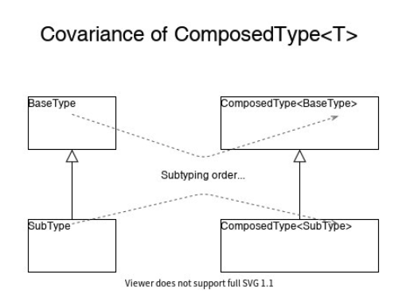
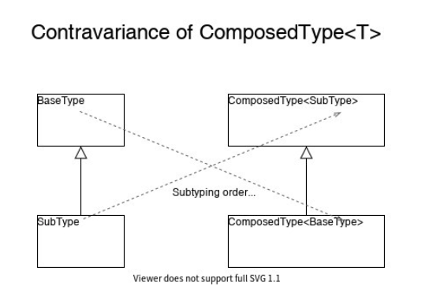
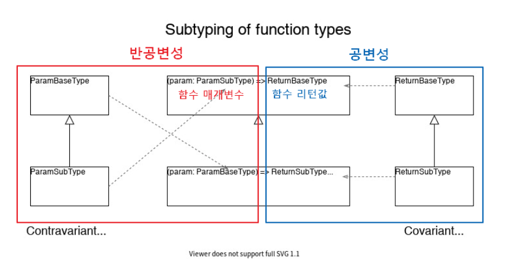

# 타입스크립트 공변성과 반공변성

> 타입스크립트 함수 타입 불일치를 겪으면서 반공변성 특징으로 인한 불일치임을 알게 되었는데 반공변성이 무엇인지 정확하게 몰라서 이번 기회에 정리를 하려고 합니다.

## 선수지식

### 용어 정리

-   `공변성(Covariance)`: A가 B의 서브타입이면, T<A>는 T<B>의 서브타입입니다.
-   `반공변성(Contravariance)`: A가 B의 서브타입이면, T<B>는 T<A>의 서브타입입니다.
-   `이변성(Bivariance)`: A가 B의 서브타입이면, T<A> -> T<B>도 가능하고 반대도 가능합니다.
-   `불변성(Immutability)`: A가 B의 서브타입이더라도, T<A> -> T<B>도 안되고 T<B> -> T<A>도 안되는 경우입니다.

### 서브타입 (어떤 타입이 좁고 어떤 타입이 넓다)

```ts
type Person = {
    gender: 'M' | 'F';
    age: number;
};

type Student = {
    gender: 'M' | 'F';
    age: number;
    school: string;
    score: number;
};

const student: Student = {
    gender: 'M',
    age: 30,
    school: 'dongma',
    score: 100
};

const person: Person = student; // OK
```

위의 소스코드를 보고 직관적으로 해석해보면, `"학생은 사람이다. 그래서 학생은 사람에 속한다"` 입니다. 이를 `슈퍼타입-서브타입` 관계라고 부를 수 있습니다.

> [!TIP]
>
> 항상 어떤 타입이 좁고, 어떤 타입이 넓다를 판단하는 것이 너무 헷갈리는 것 같습니다. 그래서 이번에 정리를 한번에 하려고 합니다.
>
> -   **B 타입의 속성을 모두 가진 A 타입은 B 타입의 서브타입입니다.**
> -   **`Student` 타입은 `Person` 타입의 속성을 모두 가지고 있기 때문에 Person의 서브타입이라고 할 수 있습니다.**
> -   **다시 말하면 `Student` 타입은 `Person` 타입의 더 구체적인 타입을 의미합니다.**

## 요약

-   타입스크립트에서 타입들은 기본적으로 공변성 규칙을 따르지만, 유일하게 함수의 매개변수는 반공변성을 갖고 있습니다 (tsconfig -> strictFunctionTypes)

---

## 공변성(Covariance)



> -   A(좁은타입)가 B(넓은타입)의 서브타입이면, `T<A>`는 `T<B>`의 서브타입입니다.
> -   A ⊂ B → T<A> ⊂ T<B>
> -   TypeScript에서 일반적인 경우입니다.

```ts
let stringArray: Array<string> = [];
let array: Array<string | number> = [];

array = stringArray;
stringArray = array; // ERROR!

let subObj: { a: string; b: number } = { a: '1', b: 1 };
let superObj: { a: string | number; b: number } = subObj;
```

**`string`은 `string | number`의 서브타입입니다. 그래서 `Array<string>`이 `Array<string | number>`의 서브타입입니다. 마찬가지로, `{ a: string; b: number }`은 `{ a: string | number; b: number }`의 서브타입입니다.**

**위와 같이 A가 B의 서브타입일 때, T<A>가 T<B>의 서브타입이 된다면 T를 공변성을 가진다라고 말합니다.**

```ts
type IsSubtypeOf<T, P> = T extends P ? true : false;

type T1 = IsSubtypeOf<Array<string>, Array<string | number>>; // true
type T2 = IsSubtypeOf<Array<string | number>, Array<string>>; // false

type T3 = IsSubtypeOf<{ a: string; b: number }, { a: string | number; b: number }>; // true
type T4 = IsSubtypeOf<{ a: string | number; b: number }, { a: string; b: number }>; // false
```

> [!TIP]
>
> `T extends P ? true : false` 를 어떻게 해석하는게 좋을까요?
>
> -   T가 P에 속해있으면 true, 그렇지 않으면 false 입니다.
> -   T가 P의 속성들을 모두 가지고 있으면 true, 그렇지 않으면 false 입니다.
> -   즉, T는 P의 서브타입이면 true, 그렇지 않으면 false 입니다.

## 반공변성(Contravariance)



> -   A(좁은타입)가 B(넓은타입)의 서브타입이면, `T<B>`는 `T<A>`의 서브타입입니다.
> -   A ⊂ B → T<B> ⊂ T<A>
> -   **공변성 규칙이 `함수의 매개변수`로 전달된 경우 반대로 동작한다.**

```ts
type Logger<T> = (param: T) => void;

let logNumber: Logger<number> = param => {
    console.log(param);
};

let log: Logger<string | number> = param => {
    console.log(param);
};

logNumber = log; // OK
log = logNumber; // ERROR
```

**공변성의 규칙을 따르면 `log` 함수는 `string | number` 타입으로 넓은 타입, `logNumber` 함수는 `number` 타입으로 보다 좁은 타입입니다. 따라서 `log = logNumber` 타입이 성립되어야 하는데 에러가 발생합니다.**

**이에 대한 이유는 함수의 매개변수의 타입을 다룰 때 반공변성으로 따르기 때문입니다. 그렇기 때문에 `logNumber = log`가 성립합니다.**

## 함수에서의 공변성과 반공변성



> [!IMPORTANT]
>
> -   함수의 리턴값 타입은 공변성을 가집니다.
> -   함수의 매개변수 타입은 반공변성을 가집니다.
> -   단, tsconfig.json에서 strictFunctionTypes 옵션이 활성화 되어야 합니다.

```ts
// T가 좁은타입, P가 넓은타입
type IsSubTypeOf<T, P> = T extends P ? true : false;

function param1(x: string): number {
    return +x;
}
function param2(x: string | number | boolean): number {
    return +x;
}

function return1(x: string): number {
    return +x;
}
function return2(x: string): number | string | boolean {
    return +x;
}

type T1 = IsSubTypeOf<typeof param1, typeof param2>; // false
type T2 = IsSubTypeOf<typeof param2, typeof param1>; // true

type T3 = IsSubTypeOf<typeof return1, typeof return2>; // true
type T4 = IsSubTypeOf<typeof return2, typeof return1>; // false
```

## 이변성 (Bi-variance)

> -   **TypeScript는 기본적으로는 함수의 인자를 다루는 과정에서 이변성 구조를 가지고 있습니다. 다시 말해, 공변성과 반공변성을 동시에 가지고 있습니다.**
> -   **이런 함수 인자가 이변성이라는 오류를 바로잡아서 위의 반공변적이게 바꿔주는 옵션이 tsconfig.json의 strictFunctionTypes 옵션입니다.**

기본적으로 매개변수가 이변성을 가지는 이유는 리턴값은 공변성을 가지는데 매개변수는 반공변성을 가짐으로 인해서 생기는 문제들이 많이 때문입니다.

---

## References

-   [[번역] 타입스크립트의 공변성과 반공변성](https://medium.com/@yujso66/%EB%B2%88%EC%97%AD-%ED%83%80%EC%9E%85%EC%8A%A4%ED%81%AC%EB%A6%BD%ED%8A%B8%EC%9D%98-%EA%B3%B5%EB%B3%80%EC%84%B1%EA%B3%BC-%EB%B0%98%EA%B3%B5%EB%B3%80%EC%84%B1-82139f7e5cc3)
-   [타입스크립트 공변성과 반공변성 핵심 이해하기](https://inpa.tistory.com/entry/TS-%F0%9F%93%98-%ED%83%80%EC%9E%85%EC%8A%A4%ED%81%AC%EB%A6%BD%ED%8A%B8-%EA%B3%B5%EB%B3%80%EC%84%B1-%EB%B0%98%EA%B3%B5%EB%B3%80%EC%84%B1-%F0%9F%92%A1-%ED%95%B5%EC%8B%AC-%EC%9D%B4%ED%95%B4%ED%95%98%EA%B8%B0)
-   [TypeScript 공변성과 반공변성](https://www.zerocho.com/category/TypeScript/post/5faa8c657753bd00048a27d8)
