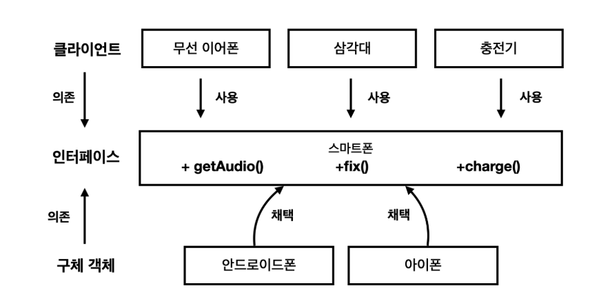
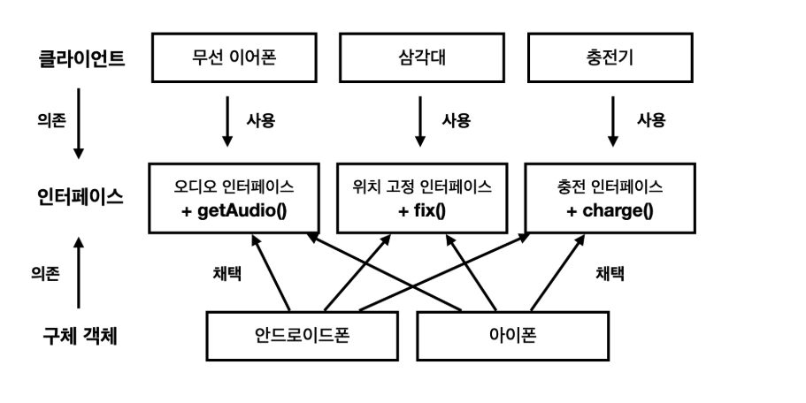
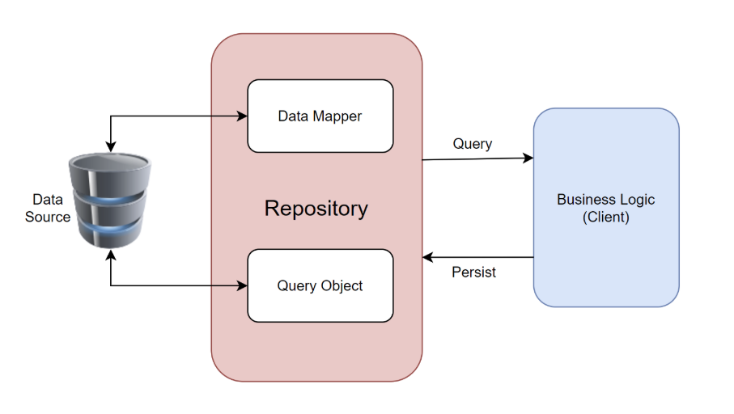
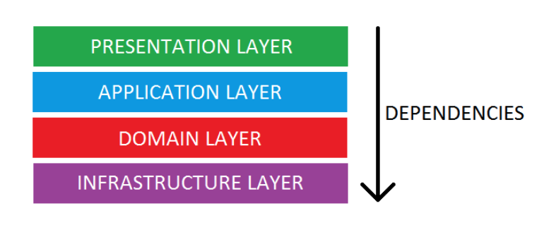

# 관심사의 분리 (Separation of Concerns)

> [!NOTE]
>
> 해당 DIL은 개인적으로 너무 흥미롭게 읽었던 [소프트웨어 설계의 근본 원칙, 관심사의 분리](https://velog.io/@eddy_song/separation-of-concerns) 벨로그 포스팅을 보고 정리한 내용입니다.

## 서론

요즈음 제일 관심이 많은 개념이 `객체지향` 입니다. 그래서 해당 DIL 글을 작성하자마자 비즈니스 로직, 도메인 로직 그리고 애플리케이션 서비스 로직의 용어에 대해서도 추가적으로 정리할 예정입니다.

저는 평소에 절차지향 적으로 코드를 작성하고 있었다고 느꼈고 개발자가 로직을 이해하는데 어려움이 있다고 몸소 느껴서 객체지향을 공부해서 적용해보고 있는데, 기본이 되는 개념이 `관심사에 대한 분리` 라고 생각했습니다. 예를 들면 비즈니스 로직과 애플리케이션 서비스 로직을 나누는 것도 관심사에 대한 분리라고 말할 수 있겠습니다.

이런 관심사 분리가 잘 되지 않으니 절차지향적으로 코드를 작성하던 제가 객체지향 적인 사고를 가지고 코드를 작성하는데는 어려움이 있었던 것 같습니다. 마침 좋은 블로그 포스팅을 보게 되어서 지금부터는 관심사 분리를 왜 분리해야 하는지에 대해서 정리를 해보려고 합니다.

## 글쓰기 = 소프트웨어 설계

요즘에는 꾸준하게 잘 쓰지는 않지만 예전에는 티스토리 블로그를 나름 자주 작성했습니다. 예를 들어, 해커톤에 참여한 스토리, 마음가짐에 대해서 작성을 하면 저는 `해커톤을 준비하는 사람들이 이 글을 보고 도움이 됐으면 좋겠다` 라고 생각을 하면서 포스팅을 작성했습니다.

**도움을 주기 위해서는 그만큼 글에서 전달력이 따라와줘야 한다고 생각했습니다. 그래서 글을 작성할 때 항상 글의 구조에 대해서 신경을 쓰고 안쓰고의 차이가 큰 것 같다고 생각했습니다.**

위의 내용이 결국 **좋은 소프트웨어 설계를 하는 것이 전달력 있는(좋은) 글을 작성하는 것과 거의 유사하다**는 것입니다.

우리가 프로그래밍을 어느정도 하다보면 기본적인 소스코드를 작성하는 능력은 쉽게 가질 수 있습니다. **그런데 그 이상으로 레벨업을 하기 위해서는 본인이 작성하는 소스코드를 어떻게 나눌것인지, 어디에 배치할 것이고 나눈 코드들은 또 어떻게 조합해서 하나의 로직을 구성할 것인지? 에 대해서 고민을 하게 됩니다.** 어쩌면 제가 관심을 가지게 된 객체지향도 소프트웨어 설계 중 하나가 될 수 있겠네요.

**즉, 소프트웨어 아키텍처는 다른 개발자의 관점에서 코드가 잘 읽히도록, 가시성을 높일 수 있도록 고민하는 것입니다.**

## 관심사의 분리가 중요한 이유

블로그 포스팅에 적혀있듯이, 개발자 오픈채팅에 올라오는 메세지들을 보면 로직을 분리해야 한다! ~를 분리해라! 라는 메세지를 몇번 본 적이 있는 것 같습니다. **관심사를 분리하라는 뜻은 소스코드를 하나의 뭉텅이로 만들지 말고 작게 쪼개서 역할을 나눠주라는 의미**입니다.

근데 왜 소스코드를 분리해야 할까? 라고 생각하는 개발자가 있을 수도 있습니다. 저 역시 처음에는 분리를 해야하는 이유에 대해서 곰곰히 생각해봤습니다. 저희 회사는 지금 전혀 분리를 하지 않고 하나의 Controller 함수에 모든 로직을 작성해서 서비스를 제공하고 있는데 사실 로직을 파악하기 어렵다는 생각을 하긴 했었습니다.

이유는 **요즈음 소프트웨어의 복잡도가 높기 때문**입니다. 인간이 **복잡한 것을 잘 다루는 방법은 잘 나누는 것**이라고 합니다. 
거대한 시스템을 우리가 다룰 수 있을 만큼의 크기로 나눕니다. 하나씩 풀어낸 다음 다시 결합해서 복잡한 하나의 물체(?)를 만들어 냅니다.

## 관심사의 분리와 응집도/결합도의 관계

정보처리기사를 공부해보면 단골 문제로 `응집도와 결합도`가 있습니다. 저도 용어는 어떤 의미인지 아는데, 아직 어떤 소스코드를 보면 "아! 이 소스코드는 결합도가 낮은 코드다!" 라는 판단을 하기에는 부족한 것 같습니다.

### 응집도(Cohesion)

> [!NOTE]
>
> -   응집도는 얼마나 비슷한 코드끼리 잘 모아져있나? 라는 의미입니다.
> -   서로 비슷비슷한 일을 하는 코드끼리 모아놓을수록 더욱 잘 나눠진 코드라고 합니다.
> -   비슷한 일을 최대한 많이 한 사람이 몰아서 하는게 효율적입니다.
> -   그래서 응집도는 높을수록 좋습니다.

### 결합도(Coupling)

> [!NOTE]
>
> -   결합도는 코드가 얼마나 독립적인가? 특정 부분이 일을 하기 위해서 외부의 도움이 얼마나 필요한가? 에 대한 의미입니다.
> -   한 사람이 하는 일을 다른 사람이 해야하는 일에 영향을 적게 받을수록 효율적입니다.
> -   결합도는 낮을수록 좋지만, 결합이 없을수는 없습니다. 책임을 잘 분배받은 객체들이 협력을 해서 전체 시스템을 구성하는 것이 좋습니다.

개념은 알겠는데 실무에서 이를 확인하면서 대처하기에는 어렵고 너무 추상적입니다. 그래서 저희는 이런 개념을 소스코드 작성할 때 적용을 해야합니다.

## 관심사 분리를 상속한 원칙들

### (1) 클린코드: 함수를 작게 나눠라

`클린코드` 라는 책에서는 "함수는 최대한 작게, 한가지 일만 하도록 할 것" 이라고 말한다고 합니다. 함수가 길고 복잡해지면 무슨 일을 하는지 이해하기가 어려워진다고 합니다. 책에서는 함수 하나가 20줄이 넘어서는 안된다고 말한다고 합니다.

함수는 작게, 한가지 일만 하게 하라는 것은 함수 단위에 관심사의 분리를 적용한 원칙이라고 할 수 있습니다.

### (2) 캡슐화: 인터페이스와 구현

> 인터페이스와 구현을 기준으로 해서 관심사 분리

-   인터페이스는 다른 객체가 메세지를 보내서 어떤 일을 해달라고 요청할 수 있는 약속입니다.
-   구현은 책임을 수행하는 방법이라고 할 수 있습니다. 내가 어떤 일을 맡아서 한다고 하면 다른 사람은 굳이 어떻게 하는지 알 필요가 없습니다.
-   객체지향 언어에서는 프로퍼티, 메서드 앞에 Public이나 Private을 적용할 수 있는 접근 제어자 기능이 있습니다.
-   캡슐화를 잘 해놓으면 다른 객체에게 영향을 주지 않고 독립적으로 구현을 바꿀 수 있습니다.

### (3) 단일 책임 원칙(SRP): 변경 이유를 기준으로 나눠라

만약, 저장해야 하는 데이터 필드가 추가되거나 정렬 방식이 바뀌게 된다고 가정할 때 여러 객체들을 바꿔야 한다면 관심사 분리가 잘 되지 않은 케이스입니다. 객체가 한번에 너무 많은 일을 하고 있고 응집도가 낮다고 볼 수 있습니다.

즉, 변경할 이유를 기준으로 객체를 분리해야 합니다.

### (4) 인터페이스 분리 원칙: 사용하는 객체 기준으로 나눠라

인터페이스는 다른 객체들이 해당 객체에게 메시지를 보내서 요청할 수 있는 작업들을 의미합니다.

**메세지를 보내는 클라이언트는 인터페이스에 의존을 하게 됩니다. 이 때 인터페이스를 별도의 추상 클래스나 프로토콜로 정의하는 것이 중요합니다. 이렇게 되면 인터페이스를 사용하는 객체 입장에서는 구체적인 객체를 알 필요가 없기 때문에 결합도가 낮아지게 됩니다. USB-C라는 규격만 따르면 충전하는 기기가 스마트폰이든 태블릿이든 상관 없는 것이 비유가 될 수 있겠습니다.**

이 때 고민을 해야하는 부분은 "어디까지 하나로 인터페이스로 묶고 어디까지 다른 인터페이스로 나눠야 할까?" 입니다. 예를 들어 하나는 충전을 위한 인터페이스고 하나는 오디오를 위한 인터페이스라고 하는 것과 같이 서로 다른 관심사를 가진 인터페이스라면 일정 수준에서 분리를 해줘야 합니다.

스마트폰 객체가 있다고 가정하면 스마트폰을 이용하는 클라이언트는 유선 이어폰, 무선 이어폰, 충전기가 있을 겁니다. 인터페이스를 스마트폰으로 추상화하고 구체 클래스로는 갤럭시, 아이폰 등으로 설정할 수 있을 것 같습니다.

사진을 보면 이어폰은 충전 인터페이스를 사용하지 않을 것이고, 충전기는 오디오 인터페이스를 사용하지 않을 것입니다. 클라이언트 기준으로 나누라는 말은 클라이언트가 사용하는 메세지 외에 다른 메세지가 인터페이스에 들어가지 않도록 나누라는 의미입니다.

**인터페이스의 관심사는 메세지를 보내는 클라이언트입니다. 따라서, 인터페이스에서 관심사를 분리할 때는 클라이언트가 필요한 인터페이스만 쓸 수 있도록 분리를 하면 좋습니다.**

### (5) MVC, MVP, MVVM과 같은 패턴: UI와 비즈니스 로직은 나눠라

UI(View)와 비즈니스 로직(Model)을 분리하는 구조가 MVC입니다. 소프트웨어의 관심사를 UI와 비즈니스 로직으로 나누자는 것이 효과적이어서 소프트웨어 개발에서 많이 채택이 되었습니다.

### (6) Repository 패턴: 비즈니스 로직과 데이터 접근을 나눠라

Model안에 들어있는 비즈니스 로직과 데이터 접근을 분리하는 것입니다. 데이터 접근은 외부 서버에 HTTP 요청을 보내거나 로컬 데이터베이스에 쿼리를 보내는 것을 의미합니다.
응답이나 요청해야하는 포맷이 바뀌었을 때 매번 로직 코드를 바꿔야 한다면 괴로울 것입니다. 그래서 비즈니스 로직과 데이터 접근도 분리하자는 아이디어가 탄생한 것입니다.

데이터 출처와 비즈니스 로직 사이에 Repository 라는 새로운 레이어를 만들고 이 레이어에서 데이터 접근을 모두 처리하도록 합니다. 이렇게 되면 모델로 뭉쳐있던 비즈니스 로직과 데이터 출처 간의 결합도가 낮아지면서 관심사 분리를 할 수 있게 됩니다.

### (7) 레이어 간 의존성 규칙: 의존성은 한쪽으로만 생기도록 나눠라

중요한 점은 안쪽 레이어는 바깥쪽 레이어에 대해서 전혀 몰라야 한다는 점입니다.

-   인프라 레이어: 백엔드 서버와 커뮤니케이션만!
-   도메인 레이어: 네트워크를 알고 요청을 보내서 업데이트 하지만, 애플리케이션 레이어가 어떻게 사용하는지는 모릅니다.
-   애플리케이션 레이어: 비즈니스 로직을 알고 도메인 모델을 관리하지만 사용자에게 어떻게 보여주는지는 모릅니다.
-   프레젠테이션 레이어: 사용자 인터렉션을 인지하고 애플리케이션 레이어를 사용하지만 하위에 있는 인프라, 도메인에 대해서는 모릅니다.

이렇게 층으로 나누고 바로 아래 레이어에만 의존하도록 만드는 것을 의존성 규칙이라고 합니다. 의존성의 방향을 한쪽으로 통일해서 역할을 명확하게 분리하고 코드의 결합도를 낮출 수 있습니다.
