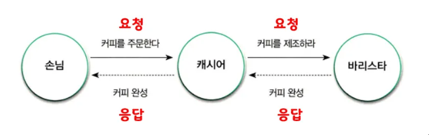

# 챕터01: 협력하는 객체들의 공동체

## 요약

> [!IMPORTANT]
>
> - 객체지향의 목표는 실세계를 모방하는 것이 아닌 새로운 세계를 창조하는 것입니다. 여기서 말하는 새로운 세계는 고객과 사용자가 만족할 수 있는 세계를 의미합니다.
> - 객체지향의 본질은 클래스가 아닌 객체입니다. 적절한 책임을 수행하는 역할 간의 유연하고 견고한 협력 관계를 구축하는 것이 중요합니다.
> - 협력, 역할과 책임, 메세지 등에 대해서 잘 알아야 합니다.

## 서론

객체지향을 제대로 배워본 적은 없지만, 객체지향을 처음 배울 때 보통 실세계와 많이 연결을 시켜서 이해한다고 합니다.<br/>
하지만 책에서는 실세계와 비유하는 것이 적합하지 않다고 말합니다. 애플리케이션을 개발하면서 객체에 직접적으로 대응되는 실세계의 사물을 발견할 확률이 낮기 때문입니다.

그럼에도 불구하고 **실세계와 연결을 하는 이유는 객체지향의 다양한 측면을 이해하고 학습하는데 매우 효과적이기 때문**이라고 합니다.

상태와 행위를 `캡슐화(Encapsulation)`하는 소프트웨어 객체의 `자율성(autonomous)`을 설명하는데 효과적입니다. 그리고, `메세지(Message)`를 주고 받으면서 공동의 목표를 달성하기 위해 `협력(Collaboration)`하는 객체들의 관계를 설명하는데 효과적이라고 합니다.

## 커피 주문 Flow 에서의 객체지향

> [!IMPORTANT]
>
> - 구성원은 크게 고객, 캐시어, 바리스타가 있습니다.
> - 핵심은 "커피 주문" 이라는 협력에 참여하는 모든 구성원들이 커피를 제공하기 위해 역할과 책임을 다한다는 것입니다.

### 요청과 응답으로 구성된 협력



일상생활을 생각해보면 어떤 문제를 해결하기 위해서 본인 혼자서 해결할 수 있지만, 보통은 다른 사람들과 협업을 통해 해결하는 편입니다. 누군가에게 특정 업무를 요청하고 요청한 결과에 대해 응답을 받는 Flow가 이루어집니다.

이는 객체에서도 마찬가지 입니다.

### 역할과 책임

손님, 캐시어, 바리스타는 모두 각각의 역할을 부여받고, 각 역할에 따른 책임이 존재합니다.

```
손님: 커피를 주문하는 역할 -> 커피를 주문할 책임
캐시어: 손님의 주문을 받는 역할 -> 주문을 받고 바리스타에게 커피 제작을 요청할 책임
바리스타: 요청받은 커피를 제조할 역할 -> 커피를 제조할 책임
```

> [!IMPORTANT]
>
> 역할과 책임은 협력이 원활하게 이루어지는데 필요한 핵심적인 구성요소 입니다.

> [!INFO]
>
> - 여러 사람들이 동일한 역할을 수행할 수 있습니다 -> 캐시어가 카페를 그만두면 다른 사람이 캐시어가 될 수 있습니다.
> - 역할은 대체 가능성을 의미합니다 -> 캐시어는 다른 사람으로 대체가 가능합니다.
> - 책임을 수행하는 방법은 자율적으로 선택할 수 있습니다 -> 바리스타는 특별한 방법으로 커피를 제조할 수 있습니다.
> - 한 사람이 동시에 여러 역할을 수행할 수 있습니다 -> 캐시어가 바리스타 역할까지 수행할 수 있습니다.

### 역할, 책임 그리고 협력

> 사람: 객체 / 에이전트 요청: 메세지 / 에이전트의 요청 처리 방법: 메서드

**협력의 핵심은 특정한 책임을 수행하는 역할들 간의 연쇄적인 요청과 응답을 통해 목표를 달성하는 것입니다.**

일상생활에서의 협력과 비슷하게 객체들은 애플리케이션의 기능을 구현하기 위해 협력합니다. 이를 위해 더 작은 책임으로 분할되고 적절한 역할을 수행할 수 있는 객체에 의해 수행됩니다.

이 책임을 다하기 위해 특정 객체는 다른 객체에 도움을 요청할 수 있으며, 다른 객체는 요청을 수행하고 응답을 할 수 있습니다.
참고로, 책임은 객체지향 설계의 품질을 결정하는 가장 중요한 요소입니다.

## 협력 속에 사는 객체

> - 협력의 효율성은 객체의 역할과 책임에 따라 달라집니다.
> - 결국, 협력의 품질을 결정하는 것은 객체의 품질이고, 이 품질은 객체에게 책임을 얼마나 적절히 분배했는지에 따라 달라집니다.

객체는 아래 2가지 덕목을 갖춰야 합니다.

- 객체는 충분히 협력적이어야 합니다.
   -> 스스로 모든 것을 제어하려고 한다면 내부적인 복잡도로 인해 문제가 발생할 수 있습니다.
- 객체는 충분히 자율적이어야 합니다.
   -> 요청에 대해 스스로 판단하고 행동해야 합니다.

## 상태와 행동을 함께 지닌 자율적인 객체

- 객체를 상태(State)와 행동(Behavior)을 함께 지닌 실체라고 정의합니다.
- 객체의 자율성은 객체의 내부와 외부를 명확하게 구분해야 합니다. 사적인 부분은 객체 스스로 관리하고 외부에서 간섭할 수 없도록 차단해야 하며, 허락된 수단을 통해서만 다른 객체와 의사소통합니다.
- 객체는 다른 객체가 무엇을 수행하는지는 알 수 있지만 어떻게 수행하는지에 대해서는 알 수 없습니다.

## 결론

- 객체지향이란 시스템을 상호작용하는 자율적인 객체들의 공동체로 바라보고 객체를 이용해 시스템을 분할하는 방법입니다.
- 자율적인 객체란 상태와 행위를 함께 지니며 스스로 자기 자신을 책임지는 객체를 의미합니다.
- 객체는 시스템의 행위를 구현하기 위해 다른 객체와 협력합니다. 각 객체는 협력 내에서 정해진 역할을 수행하며 역할은 관련된 책임의 집합입니다.
- 객체는 다른 객체와 협력하기 위해 메세지를 전송하고, 메세지를 수신한 객체는 메세지를 처리하는 데 적합한 메서드를 자율적으로 선택합니다.

## 참고

지금까지 무조건 `객체지향 = 클래스` 라고 생각하고 있었습니다. 하지만 이는 틀린 개념이라고 합니다.

객체지향의 본질은 클래스가 아닌 객체이며, 적절한 책임을 수행하는 역할 간의 유연하고 견고한 협력 관계를 구축하는 것이 중요합니다. 단순히 클래스는 객체를 위한 구현 메커니즘일 뿐입니다.