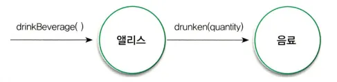

# 챕터02: 이상한 나라의 객체

## 서론

챕터2의 시작은 아기들의 객체 인지에 대한 소개로 시작하고 있습니다.

> [!NOTE]
>
> - 가림막 뒤에 막대 두개를 동일한 방향으로 움직이게 하면서 지루할 때까지 반복합니다.
> - 1개로만 보이면 아기가 지루해하겠지만 갑자기 2개가 보이면 흥미를 가지게 됩니다.

**위의 내용을 보면 아기들도 뚜렷한 경계를 가지고 함께 행동하는 물체를 하나의 개념으로 인지한다는 것입니다.**

**우리는 무언가를 인지할 수 있는 능력을 가지고 있습니다. 객체지향은 세상을 자율적이고 독립적인 객체들로 분해할 수 있는 사람의 기본적인 인지능력에 기반을 두고 있습니다.**

## 객체지향의 인지 능력

객체지향을 직관적이고 이해하기 쉬운 패러다임이라고 말하는 이유는 인간의 기본적인 인지 능력에 기반을 두고 있기 때문입니다. 지금 이 글을 쓰고 있는 시점에서 필자는 모니터 객체, 노트북 객체, 키보드 객체 등으로 나눌 수 있을 것 같습니다.

하지만, 객체는 현실세계를 모방하는 것이 아닌 새로운 세계를 창조하는 것입니다. 예를 들어, 사람의 손길 없이 스스로 불을 밝힐 수 없는 전등과 다르게 소프트웨어 세계에서는 전등은 외부의 도움 없이도 처리가 가능합니다.

> [!NOTE]
>
> "객체는 현실세계를 모방하는 것이 아닌 새로운 세계를 창조하는 것이다" 라는 말이 이해가 안될 수 있는데 후반에 설명하도록 하겠습니다.

## 이상한 나라의 앨리스

```
저자는 이상한 나라의 엘리스에 대한 얘기를 해주고 있습니다.
요약을 해보자면 주인공 엘리스는 몸을 작게 만들어서 문을 통과해 아름다운 정원에 들어가고 싶어합니다.
주위에 있는 '마셔라'라는 병을 마시거나 부채를 이용해 부채질을 하거나 버섯의 한쪽을 먹어서 몸을 작게 만들 수 있습니다.
반대로 케이크를 먹거나 버섯의 다른쪽을 먹어서 몸의 크기를 늘릴 수 있습니다.
```

위의 내용을 본다면, 앨리스는 다음과 같은 특징을 가질 수 있습니다.

- 상태를 가지며, 상태는 변경이 가능합니다.
- 상태를 변경시키는 것은 엘리스의 행동입니다.
   - 행동의 결과는 상태에 의존적입니다.
   - 행동의 순서가 결과에 영향을 미칩니다.
- 엘리스의 상태가 변하더라도 엘리스는 유일한 존재로 식별이 가능합니다.

## 객체, 그리고 소프트웨어 나라 (상태, 행동 그리고 식별자)

> [!IMPORTANT]
>
> - 객체는 식별 가능한 개체 또는 사물입니다.
> - 객체는 자동차처럼 만질 수 있는 구체적인 사물일수도 있고, 시간처럼 추상적인 개념일 수 있습니다.
> - 객체는 구별 가능한 식별자, 특징적인 행동, 변경 가능한 상태를 가집니다.
> - 소프트웨어 안에서 객체는 저장된 상태와 실행 가능한 코드를 통해 구현됩니다.

### 상태

**예를 들어, 본인이 가게를 운영하는 사장님이라고 가정해보겠습니다. 만약 불가피한 사정으로 가게를 운영하지 못하는데, 상태값이 없다면 가게가 운영불가라는 상태로 변경할 수 없을 것입니다.**

**이렇게 되면, 상태를 알게 되면 과거에 얽매이지 않고 현재를 기반으로 객체의 행동 방식을 이해할 수 있습니다.**

#### 상태와 프로퍼티

> 프로퍼티(Property)는 객체의 상태를 구성하는 모든 특징을 통틀어 객체의 프로퍼티라고 합니다. 변경되지 않기 때문에 고정적이며, 프로퍼티 값은 변경될 수 있기 때문에 동적입니다.

엘리스가 음료수를 들고 있다면 엘리스 객체와 음료 객체는 밀접한 관계를 지니게 되고, 엘리스가 음로수를 버리게 되면 관계가 사라지는 것입니다.

위의 상황에서 객체와 객체 사이의 의미 있는 연결을 `링크(Link)` 라고 부릅니다. 객체와 객체 사이에는 링크가 존재해야만 요청을 송수신할 수 있습니다. 다시 말해서, 링크가 있어야 메세지를 주고받을 수 있습니다.

> [!IMPORTANT]
>
> - 객체는 스스로 상태를 변경해야 합니다.
> - 객체는 스스로의 행동에 의해서만 상태가 변경되는 것을 보장함으로써 객체의 자율성을 유지하기 때문입니다.

### 상태와 행동

**객체의 행동은 상태에 영향을 받지만, 객체의 행동은 상태를 변경시킵니다.**

**행동은 외부의 요청 또는 수신된 메세지에 응답하기 위해 동작하고 반응하는 활동입니다. 행동의 결과로 객체는 자신의 상태를 변경하거나 다른 객체에게 메시지를 전달할 수 있습니다. 객체는 행동을 통해 다른 객체와의 협력에 참여하므로 행동은 외부에 가시적이어야 합니다.**

### 상태 캡슐화



앨리스는 음료수를 마셨고 음료에게 마셨다는 메세지를 보내고 있습니다. 서로 어떤 메세지를 주고 받았는지는 알 수 있지만 두 객체의 상태는 사진만 봐서는 알 수 없습니다.

위와 같은 개념이 `캡슐화`입니다. 자신의 상태를 외부가 알 수 없게 숨기는 행위를 의미합니다.

**상태를 잘 정의된 행동 집합 뒤로 캡슐화하는 것은 객체의 자율성을 높이고 협력을 단순하고 유연하게 만드는데, 이것이 상태를 캡슐화해야 하는 이유입니다.**


<br/>

## 행동이 상태를 결정한다

> 상태를 중심으로 객체를 바라보면 안됩니다!

> [!IMPORTANT]
>
> - 상태를 먼저 결정할 경우 캡슐화가 저해됩니다. 상태에 초점을 맞출 경우 상태가 객체 내부로 깔끔하게 캡슐화되지 못하고 공용 인터페이스에 그대로 노출되버릴 확률이 높아집니다.
> - 객체를 협력자가 아닌 고립된 섬으로 만듭니다. 상태를 먼저 고려하는 방식은 협력이라는 문맥에서 멀리 벗어난 채 객체를 설계하게 함으로써 자연스럽게 협력에 적합하지 못한 객체를 창조하게 됩니다.
> - 객체의 재사용성이 저하됩니다. 상태에 초점을 맞추면 다양한 협력에 참여하기 어렵기 때문에 재사용성이 저하됩니다.

**위와 같은 이유로 행동에 초점을 맞춰야 하고, 객체가 적합한지를 결정하는 것은 그 객체의 상태가 아닌 행동입니다.**

`책임-주도 설계`는 협력이라는 문맥 안에서 객체의 행동을 생각하도록 도움으로써 응집도 높고 재사용 가능한 객체를 만들 수 있게 합니다.

즉, `행동이 상태를 결정합니다`.

<br/>

## 은유와 객체

객체지향을 현실세계에 은유할 수 있지만, **현실 세계를 모방하는 것은 아닙니다.** 객체지향을 현실세계의 추상화라고 표현하는 것은 잘못됐습니다.

> [!NOTE]
>
> < 현실세계와 객체지향세계의 큰 차이점은 무엇일까요? >
>
> - 소프트웨어 세계의 객체는 능동적으로 변합니다. 초능력을 가지는 것처럼 새로운 능력을 가질 수 있고 또 다른 존재가 될 수도 있습니다.
> - 현실 세계의 물체가 소프트웨어 세계에서는 전지전능한 존재가 될 수 있습니다. 이를 의인화라고 부를 수 있습니다.
> - 그래서 모방하는 것이 아닌 현실의 모습을 조금 참조할 뿐, 새로운 세계를 창조합니다.

---

## References

- [[객체지향의 사실과 오해] Chapter 2](https://changha-dev.tistory.com/172)
- [Chapter2. 이상한 나라의 객체](https://glass-milkshake-24b.notion.site/Chapter-2-f8d2d76ee89c487ba65fc2c8d870440b#67549c8088fa4f4687291082e8250705)