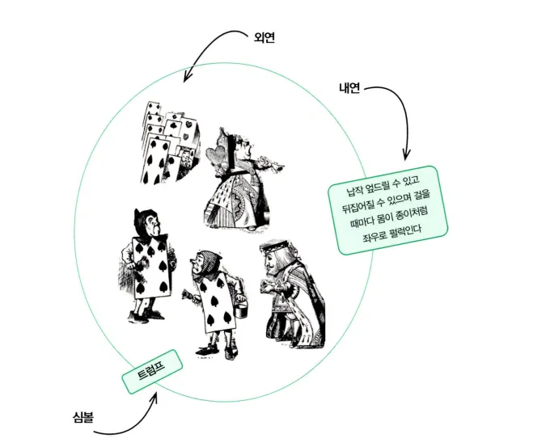
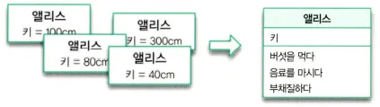

# 챕터03: 타입과 추상화

## 서론

책에서는 `지하철 노선도`를 예시로 들고 있습니다. 지하철 노선도는 나라의 지형과 모양을 고려해서 만든 것이 아닌 승객들이 필요한 정보만 담아서 추상화해서 보기 쉽게 만들어져 있습니다.

## 추상화를 통한 복잡성 극복

현실은 복잡하고 예측 불가능합니다. 그래서 사람들은 본능적으로 이해하기 쉽고 예측 가능한 수준으로 현실을 분해하고 단순화하는 전략을 따르려고 합니다.

`추상화`는 현실에서 출발하되 불필요한 부분을 도려내가면서 사물의 본질을 드러나게 하는 과정입니다.

조금 더 자세하게 정리해보면, 추상화는 어떤 양상, 세부 사항, 구조를 좀 더 명확하게 이해하기 위해 특정 절차나 물체를 의도적으로 생략하거나 감춤으로써 복잡도를 극복하는 방법입니다.

> [!IMPORTANT]
>
> - 구체적 사물들 간의 공통점은 취하고 차이점은 버리는 일반화를 통해 단순하게 만드는 것.
> - 중요한 부분을 강조하기 위해 불필요한 세부 사항을 제거함으로써 단순하게 만드는 것.

 

## 객체지향과 추상화

책에서는 `엘리스가 하트여왕, 토끼, 신하, 병사들을 보면서 트럼프에 불과하다고 말합니다.`
이는 객체를 트럼프로 그룹화 시킨 것인데 `트럼프` 라는 유사성을 기반으로 추상화를 한 것입니다.

### 개념

엘리스가 인물들의 차이점을 무시하고 공통점만을 취해서 트럼프 라는 개념으로 단순화 한 것입니다. 이는 추상화라고 볼 수 있습니다.

`개념(Concept)`은 **우리가 인식하고 있는 다양한 사물이나 객체에 적용할 수 있는 아이디어나 관념을 말합니다.** 개념을 활용하면 객체를 여러 그룹으로 분류할 수 있습니다.

그리고, 객체에 어떤 개념을 적용하는 것이 가능해서 개념 그룹의 일원이 될 때 객체를 그 개념의 `인스턴스(Instance)` 라고 합니다.

> [!NOTE]
>
> 객체란, 특정한 개념을 적용할 수 있는 구체적인 사물을 의미합니다. 개념이 객체에 적용됐을 때 객체를 개념의 인스턴스라고 합니다.

### 개념의 3가지 관점

> - 심볼(Symbol): 개념을 가리키는 간략한 이름이나 명칭
> - 내연(Intension): 개념의 완전한 정의를 나타내며 내연의 의미를 이용해 객체가 개념에 속하는지 여부를 확인할 수 있습니다.
> - 외연(Extension): 개념에 속하는 모든 객체의 집합(Set)

`심볼`은 **개념을 가리키는 이름**입니다. 엘리스가 정원의 객체를 지칭할 때 사용한 트럼프가 개념의 심볼입니다.

`내연`은 **개념의 의미**를 말합니다. 몸이 납작하고 두손과 두발이 네모난 몸 모서리에 달려있다는 트럼프에 대한 설명입니다.

`외연`은 **개념에 속하는 객체들, 개념의 인스턴스들이 모여 이뤄진 집합**을 가리킵니다. 토끼를 뺀 정원의 객체들은 트럼프의 외연을 구성하는 객체 집합에 속합니다.

### 객체를 분류하기 위한 틀

`분류(Classification)`는 **객체에 특정한 개념을 적용**하는 작업입니다. 객체에 특정한 개념을 적용하기로 했을 때 그 객체를 특정한 집합의 멤버로 분류하고 있는 것입니다.

분류가 객체지향의 가장 중요한 개념 중 하나인데, 어떤 객체를 어떤 개념으로 분류할지가 객체지향의 품질을 결정합니다. 즉, **분류는 추상화를 위한 도구입니다.**

 

## 타입

### 타입은 개념이다

> [!TIP]
>
> 타입은 개념과 동일합니다. 따라서, 타입이란 우리가 인식하고 있는 다양한 사물이나 객체에 적용할 수 있는 아이디어나 관념을 의미합니다. 어떤 객체에 타입을 적용할 수 있을 때 그 객체를 타입의 인스턴스라고 합니다. 타입의 인스턴스는 타입을 구성하는 외연인 객체 집합의 일원이 됩니다.

### 데이터 타입

`타입시스템`의 목적은 **메모리 안의 모든 데이터가 비트열로 보임으로써 야기되는 혼란을 방지하는 것입니다.** 0과 1에 대해 수행 가능한 작업과 수행 불가능한 작업을 구분하면서 데이터가 잘못 사용되는 것을 방지합니다.

- **타입은 데이터가 어떻게 사용되느냐에 관한 것**
  - 데이터가 어떤 타입에 속하는지를 결정하는 것은 데이터에 적용할 수 있는 작업입니다.
  - 일반적으로 데이터를 이용해 수행할 수 있는 작업을 연산자라고 합니다.
  - 어떤 데이터에 어떤 연산자를 적용할 수 있느냐가 데이터 타입을 결정합니다.
- **타입에 속한 데이터를 메모리에 어떻게 표현하는지는 외부로부터 철저하게 감춰집니다.**
  - 개발자는 해당 데이터 타입을 사용하기 위해 단지 데이터 타입에 적용할 수 있는 연산자만 알면 됩니다.
  - 따라서, 숫자형 데이터에 적용할 수 있는 산술 연산자를 알고있다면 메모리 내부에 숫자가 어떤 방식으로 저장되는지를 모르더라도 숫자형 데이터를 사용할 수 있습니다.

> [!NOTE]
>
> 데이터 타입은 메모리 안에 저장된 데이터의 종류를 분류하는데 사용하는 메모리 집합에 관한 메타데이터입니다. 데이터에 대한 분류는 암시적으로 어떤 종류의 연산이 해당 데이터에 대해 수행될 수 있는지를 결정합니다.

### 객체와 타입

- **어떤 객체가 어떤 타입에 속하는지를 결정하는 것은 객체가 수행하는 행동입니다.**
  - 어떤 객체들이 동일한 행동을 수행할 수 있다면, 그 객체들은 동일한 타입으로 분류될 수 있습니다.
- **객체의 내부적인 표현은 외부로부터 철저하게 감춰집니다.**
  - 객체의 행동을 가장 효과적으로 수행할 수만 있다면 객체 내부의 상태를 어떤 방식으로 표현하더라도 무방합니다.

### 행동이 우선이다

**어떤 행동을 하느냐에 따라 객체의 타입이 결정됩니다.** 따라서, 동일한 책임을 수행하는 일련의 객체는 동일한 타입에 속한다고 말할 수 있습니다.

**즉, 객체의 타입을 결정하는 것은 객체의 행동입니다. 객체가 어떤 데이터를 보유하고 있는지는 타입을 결정하는데 아무런 영향도 미치지 않습니다.**

**위 문장의 의미는 서로 다른 내부를 가지고 있음에도 불구하고 책임이 동일하다는 것입니다. 이는 `다형성`을 의미합니다.**

`다형성`이란, **동일한 요청에 대해 서로 다른 방식으로 응답할 수 있는 능력을 뜻합니다. 결과적으로 다형적인 객체들은 동일한 타입에 속하게 됩니다.**

> [!NOTE]
>
> - 외부의 위험으로부터 보호하기 위해 캡슐화가 필요합니다.
> - 객체는 외부에 제공해야하는 행동을 생각해야 하고, 책임을 먼저 결정해야 합니다.
> - 이후 그 책임을 수행하는데 적합한 데이터를 나중에 결정하고 데이터를 책임을 수행하는데 필요한 외부 인터페이스 뒤로 캡슐화를 해야합니다.
> - 그렇기 때문에 책임-주도 설계가 필요합니다.

 

## 타입의 계층

### 트럼프 계층

`트럼프` 라고 봤지만, 실제로는 `트럼프 인간`으로 보는 것이 맞습니다. 트럼프와 트럼프 인간은 비슷하긴 하지만 다른 존재입니다.

트럼프 인간을 포괄하는 이 개념 사이의 관계를 `일반화/특수화 관계`라고 합니다.

### 일반화/특수화 관계

**트럼프 인간은 트럼프를 더 특수하게 표현한 것입니다. 더 특수하다는 것은 일반적인 개념보다 범위가 더 좁다는 것을 의미하기 때문에 트럼프 인간에 속하는 객체는 트럼프에 속하는 객체보다 그 수가 적을 수 밖에 없습니다.**

중요한 것은 `일반화/특수화` 관계를 결정하는 것은 `객체의 행동` 입니다.

### 슈퍼타입과 서브타입

> 일반적인 타입을 슈퍼타입, 특수한 타입을 서브타입이라고 부릅니다.

 

## 정적 모델

### 타입의 목적

> 타입을 사용하는 이유는 인간의 인지 능력으로는 시간에 따라 동적으로 변하는 객체의 복잡성을 극복하기가 너무 어렵기 때문입니다.

동적으로 변하는 상태를 독립적인 정적인 모습으로 만들어주는데 이는 `복잡성을 제거` 하는 겁니다.
그래서 결국에는 `타입은 추상화`입니다.

## 클래스

**객체를 분류하는 기준은 타입입니다. 그리고 타입을 나누는 기준은 객체가 수행하는 행동입니다.**

객체를 분류하기 위해 타입을 결정한 후 프로그래밍 언어를 이용해 타입을 구현할 수 있는 방법들 중 한가지가 `클래스`일 뿐입니다.

**결국 객체지향에서 중요한 것은 동적으로 변하는 객체의 상태와 상태를 변경하는 행위입니다. 클래스는 타입을 구현하기 위해 프로그래밍 언어에서 제공하는 구현 매커니즘입니다.**