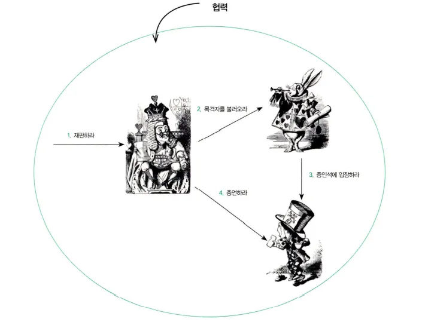
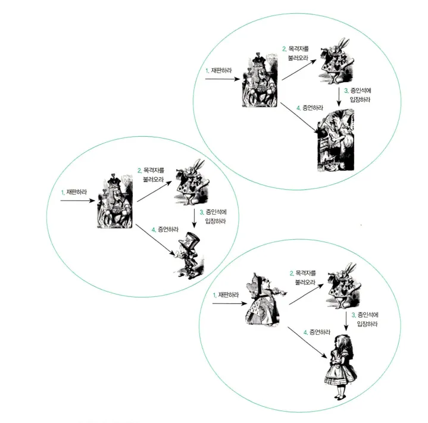

# 챕터04: 역할, 책임, 협력

## 서론

### 최후통첩 게임

책의 서론에서는 `최후통첩 게임` 이라는 것을 언급합니다. 최후통첩 게임에 대한 설명은 아래와 같습니다.

> [!NOTE]
>
> - 처음에 제안자는 돈을 받고, 제안자는 그 돈에서 일부를 응답자와 꼭 나눠가져야 합니다.
> - 제안자는 9:1, 8:2, 7:3 과 같은 비율로 자유롭게 응답자와 돈을 나눠가질 수 있습니다.
> - 다만, 응답자는 제안자의 제안을 거절할 수 있고, 거절을 하게 되면 두 사람 모두 돈을 가질 수 없습니다.

필자가 응답자라면 당연히 `9:1` 비율이어도 돈을 받았을 것 같습니다. 하지만 책에서는 20% 이하의 금액을 제안받은 경우에는 제안을 거부했다고 설명합니다.

하지만 필자가 제안자라면 `9:1` 비율로 제안하지는 않았을 것 같고 책에서 말하듯이 `6:4` 또는 `7:3` 비율로 제안을 했을 것 같습니다. 9:1과 같은 비율로 제안을 하게 되면 응답자가 제안을 거절할 확률이 급격하게 높아지기 때문입니다.

필자는 위의 시나리오가 독자들에게 전하고자 하는 것이 무엇인지를 아직 제대로 이해하지 못했습니다.
**책에서는 `인간의 행동을 결정하는 문맥은 타인과의 협력` 이라는 것이라고 말합니다.**

**협력이 얼마나 적절한지에 따라 행동의 적합성이 결정되고 협력이라는 문맥이 인간의 행동 방식을 결정하는 것이라고 합니다.**

> [!IMPORTANT]
>
> - 객체의 세계에서도 협력이라는 문맥이 객체의 행동 방식을 결정합니다.
> - 객체지향 설계의 품질을 결정하는 것은 객체들이 모여 이뤄내는 협력의 품질입니다.
> - 어떤 협력에 참여하는지가 객체에 필요한 행동을 결정하고, 필요한 행동이 객체의 상태를 결정합니다.

<br/>

## 협력

### 요청하고 응답하며 협력하는 사람들

`협력`은 한 사람이 다른 사람에게 도움을 요청할 때 시작됩니다. 요청을 처리할 때 다른 사람의 도움이 필요하면 또 다른 사람에게 도움을 요청할 수도 있습니다.

**또한, 요청을 처리하다가 다른 사람이 요청한 내용에 대해 응답할 수도 있습니다. 결론은 협력은 다수의 요청과 응답으로 구성되고 전체적으로 협력은 다수의 연쇄적인 요청과 응답의 흐름으로 구성된다는 점입니다.**

### 재판 속의 협력



위 사진에서 `하트왕`, `하얀토끼`, `모자장수`는 모두 `하트잭을 재판` 하기 위해 모인 등장인물(객체)입니다. 이들은 모두 `하트잭을 재판` 한다는 목표를 달성하기 위해 협력하는 관계입니다.

> [!IMPORTANT]
>
> - 요청과 응답으로 협력이 이루어지고 있습니다.
> - 요청과 응답은 협력에 참여하는 객체가 수행할 책임을 정의할 수 있습니다.

<br/>

## 책임

`하트왕`은 `재판을 수행해라!`는 요청에 응답해야 하기 때문에 `재판을 수행할` 책임이 있습니다. **즉, 객체지향 패러다임에서 어떤 객체가 어떤 요청에 대해 대답해 줄 수 있거나, 적절한 행동을 할 의무가 있는 경우 해당 객체가 책임을 가진다고 말합니다.**

**그리고, 어떤 대상에 대한 요청은 그 대상이 요청을 처리할 책임이 있음을 암시할 수 있습니다. **`하트왕`은 `하얀토끼`에게 증인을 불러오라고 요청합니다. 이는 하얀토끼는 `증인을 불러올` 책임이 있다고 예상할 수 있습니다.

> [!IMPORTANT]
>
> - 책임은 객체지향 설계의 가장 중요한 재료입니다.
> - 책임을 어떻게 구현할지? 를 먼저 고민하지 말고, 객체와 책임을 먼저 설계한 후에 고민하는 것이 중요합니다.

### 책임의 분류

> - 책임은 객체에 의해 정의되는 응집도 있는 행위의 집합입니다.
> - 객체의 책임은 `객체가 무엇을 알고있는지?(Knowing)`과 `무엇을 할수 있는지?(Doing)`으로 구성됩니다.

```
<하는것(Doing)>
- 객체를 생성하거나 계산을 하는 등의 스스로 하는 것
- 다른 객체의 행동을 시작시키는 것
- 다른 객체의 활동을 제어하고 조절하는 것

<아는것(Knowing)>
- 개인적인 정보에 관해 아는 것
- 관련된 객체에 관해 아는 것
- 자신이 유도하거나 계산할 수 있는 것에 관해 아는 것
```

예시 하나만 들어보겠습니다. **왕은 하얀토끼에게 목격자를 불러오라고 시키고, 모자장수에게 증언을 요청합니다. 따라서 왕은 하는것과 관련된 책임을 수행하고 있습니다.**

> [!IMPORTANT]
>
> - 책임은 객체의 외부에 제공해 줄 수 있는 정보(아는 것의 측면)와 외부에 제공해 줄 수 있는 서비스(하는 것의 측면)의 목록입니다.
> - 따라서 책임은 객체의 공용 인터페이스를 구성하고, 공용 인터페이스는 객체지향의 원리 중 하나인 캡슐화로 이어집니다.

### 책임과 메세지

> - 협력 안에서 객체는 다른 객체로부터 요청이 전송됐을 경우에만 자신에게 주어진 책임을 수행합니다.
> - 결국 한 객체가 다른 객체에게 전송한 요청은 그 요청을 수신한 객체의 책임이 수행되게 합니다.
> - 이처럼 객체가 다른 객체에게 주어진 책임을 수행하도록 요청을 보내는 것을 `메세지 전송` 이라고 합니다.

**두 객체 간의 협력은 `메세지`를 통해 이루어진다고 합니다. 메세지는 협력을 위해 한 객체가 다른 객체로 접근할 수 있는 유일한 방법입니다.**

`책임`은 **협력이라는 문맥 속에서 요청을 수신하는 한 쪽의 객체 관점에서 무엇을 할 수 있는지를 나열하는 것입니다.** 예를 들어, 모자장수는 증언을 해야할 책임이 있습니다. 이는 증언을 할 수 있다는 행위를 외부에게 제공할 수 있다는 의미입니다.

`메세지`는 **협력에 참여하는 두 객체 사이의 관계를 강조하는 것입니다.** 왕은 모자장수에게 증언하라는 메세지를 전달할 수 있고, 모자장수는 증언하라는 메세지를 수신할 수 있습니다.

> [!IMPORTANT]
>
> - 객체지향 설계는 협력에 참여하기 위해 어떤 객체가 어떤 책임을 수행해야 하고, 어떤 객체로부터 메세지를 수신할 것인지를 결정하는 것으로부터 시작됩니다.
> - 어떤 클래스가 필요하고, 어떤 메서드를 포함해야 하는지를 결정하는 것은 책임과 메세지에 대한 윤곽을 잡은 후에 시작해도 늦지 않습니다.

<br/>

## 역할



`하트왕` 대신 `하트여왕`이, `모자장수` 대신 `엘리스`가 협력에 참여할 수 있습니다. 다만 대체되는 객체가 기존에 수행하던 객체의 역할을 해낼 수 있다는 가정하에 가능합니다.

### 역할이 답이다

먼저, 위의 사진에서 우리는 `하트왕 또는 하트여왕`을 `판사`로, `엘리스 또는 모자장수`를 `증인`으로 `추상화` 할 수 있습니다. 우리가 아는 판사와 증인의 역할을 이 객체들이 수행하고 있기 때문입니다.

> [!NOTE]
>
> 책에서는 하얀토끼에 대해서는 추상화를 진행하지 않았는데요, 실제 재판에서 이런 역할이 있었던 걸로 기억하는데 역할 명은 잘 기억이 나지 않네요. 추상화가 마찬가지로 가능할 것 같습니다.

역할은 서로 다른 객체로 대체할 수 있습니다. 하지만 모든 객체들이 각 역할을 수행할 수는 없습니다. **대체할 수 있는 조건은 `각 역할이 수신할 수 있는 메세지를 동일한 방식으로 이해할 수 있는가?` 입니다.**

> [!IMPORTANT]
>
> - 다양한 객체들이 협력에 참여할 수 있기 때문에 협력이 유연해지고 다양한 객체들이 동일한 협력에 참여할 수 있기 때문에 재사용성이 높아집니다.
> - 역할(Role)은 객체지향 설계의 단순성, 유연성 그리고 재사용성을 뒷받침하는 개념입니다.

<br/>

## 객체의 모양을 결정하는 협력

### 협력을 따라 흐르는 객체의 책임

**올바른 객체를 설계하기 위해서는 먼저 견고하고 깔끔한 협력을 설계해야 합니다. 협력을 설계한다는 것은 설계에 참여하는 객체들이 주고받을 요청과 응답의 흐름을 결정한다는 것을 의미합니다. 이렇게 결정된 흐름은 객체가 협력에 참여하기 위해 수행될 책임이 됩니다.**

> [!IMPORTANT]
>
> < 올바른 객체 설계하기 >
>
> - (1) 책임(행동) 결정하기
> - (2) 행동을 수행하는데 필요한 데이터를 고민하기
> - (3) 클래스 구현 방법 고민하기

**객체의 행위에 초점을 맞추기 위해서는 협력이라는 실행 문맥 안에서 책임을 분배해야 합니다. 각 객체가 가져야 하는 상태와 행위에 대해 고민하기 전에 그 객체가 참여할 문맥인 협력을 정의해야 합니다.**

<br/>

## 객체지향 설계 기법

### 책임-주도 설계 (Responsibility-Driven Design)

> - 협력에 필요한 책임들을 식별하고 적합한 객체에게 책임을 할당하는 방식으로 애플리케이션을 설계하는 기법
> - 객체의 책임을 중심으로 시스템을 구축하는 설계 방법

**시스템의 책임을 객체의 책임으로 변환하고, 각 객체가 책임을 수행하는 중에 필요한 정보나 서비스를 제공해줄 협력자를 찾아서 해당 협력자에게 책임을 할당하는 순차적인 방식으로 객체들의 협력 공동체를 구축합니다.**

```
- 시스템이 사용자에게 제공해야 하는 기능인 시스템 책임을 파악합니다.
- 시스템 책임을 더 작은 책임으로 분할합니다.
- 분할된 책임을 수행할 수 있는 적절한 객체 또는 역할을 찾아 책임을 할당합니다.
- 객체가 책임을 수행하는 중에 다른 객체의 도움이 필요한 경우 이를 책임질 적절한 객체 또는 역할을 찾습니다.
- 해당 객체 또는 역할에게 책임을 할당하면서 두 객체가 협력하게 됩니다.
```

### 디자인 패턴 (Design Pattern)

> - 전문가들이 반복적으로 사용하는 해결 방법을 정의해 놓은 설계 탬플릿의 모음입니다.
> - 패턴은 전문가들이 특정 문제를 해결하기 위해 식별해 놓은 역할, 책임, 협력의 모음입니다.

반복적으로 발생하는 문제와 그 문제에 대한 해법의 쌍으로 정의됩니다. 패턴은 해결하려고 하는 문제가 무엇인지를 명확하게 서술하고 패턴을 적용할 수 있는 상황과 적용할 수 없는 상황을 설명합니다.

### 테스트-주도 개발 (Test-Driven Development)

> - 테스트를 먼저 작성하고 테스트를 통과하는 구체적인 코드를 추가하면서 애플리케이션을 완성해가는 방식입니다.
> - 실패하는 테스트를 작성하고 테스트를 통과하는 간단한 코드를 작성해서 리팩터링을 통해 중복을 제거하는 것입니다.

테스트-주도 개발을 위해서는 객체지향에 대한 지식이 어느정도 있어야 합니다. 그리고 테스트를 작성하기 위해 객체의 메서드를 호출하고 반환값을 검증하는 것은 순간적으로 객체가 수행해야 하는 책임에 관해 생각한 것입니다.