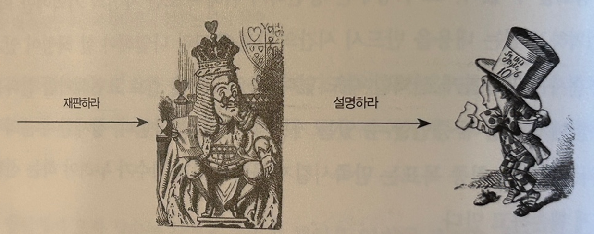

# 챕터05: 책임과 메세지

## 서론

어떤 위급한 상황이 발생했을 때 단 둘이 있을 때와 여러명이 있을 때 책임감의 차이가 있다고 예시를 통해서 말합니다. 그리고 책임감이 분산될수록 책임을 무시하려고 하는 경향이 있습니다.

예시에서 말하고자 하는 것은 **훌륭한 객체지향 세계는 명확하게 정의된 역할과 책임을 지닌 객체들이 상호 협력하는 세계**라고 합니다.

## 자율적인 책임

### 설계의 품질을 좌우하는 책임

객체지향 공동체를 구성하는 기본 단위는 `자율적인 객체` 입니다. 각 객체들은 애플리케이션의 기능을 구현하기 위해 협력하고, 협력 과정에서 각자 맡은 바 책임을 다하기 위해 자율적으로 판단하고 행동합니다.

자율성이 핵심인데, 자율성은 "자기 스스로의 원칙에 따라서만 움직이는 성질"을 의미합니다. 
따라서, 위에서 말하는 **자율적인 객체는 스스로 정한 원칙에 따라 판단하고 스스로의 의지를 기반으로 행동하는 객체**를 말합니다.

다른 객체가 특정 객체에게 요청을 보내면 요청을 받은 객체가 행동을 합니다. 이 때 요청을 수신한 객체가 해야하는 행동을 `책임`이라고 부릅니다.

**결과적으로는, 적절하게 책임을 부여해야 자율적인 객체가 생성되는 것이고, 그런 자율적인 객체들이 모여서 유연하고 단순한 협력을 만들게 되고, 그것이 애플리케이션의 품질을 결정합니다.**

### 자신의 의지에 따라 증언할 수 있는 자유

예전 그림과 다르게 지금은 왕이 단순히 증언하라는 요청을 하는 것이 아닌 구체적으로 요청을 하고 있습니다. 이렇게 되면 요청 수신자는 자유롭게 증언을 하지 못한다는 것입니다.

수신자가 기억을 떠올리지 못해서 메모를 참고할 수도 있고, 말주변이 없어서 문서를 통해 제출할 수도 있는데 이런 것들이 수신자의 동작을 제한하는 요소가 된다는 것입니다.

> [!IMPORTANT]
>
> 결과적으로는 책임이 너무 구체적이면 객체의 자율성이 떨어진다는 것입니다. 그래서 객체의 자율성을 보장하기 위해서는 객체에 할당되어야 하는 책임도 자율적이어야 한다는 것입니다.

### 너무 추상적인 책임

이전과 다르게 증언하라고 하는 것이 아니라 설명하라고 요청을 보낸다고 가정해보면, 수신자는 "설명해라" 라는 요청에 대해서만 행동을 수행합니다.

물론 `재판` 이라는 상황에 맞게 적절한 답변을 할 수 있습니다. 하지만 그렇지 못할 가능성이 존재한다는 것입니다.

> [!IMPORTANT]
>
> 추상적이고 포괄적인 책임은 다양한 환경에서 사용될 수 있는 유연성을 보장하지만 협력에 참여하는 의도를 명확하게 설명할 수 있는 수준에서 `추상화`가 이루어져야 합니다.

**결국 올바른 객체의 책임은 객체의 자율성을 보장할 수 있도록 충분히 추상적이어야 하며, 그와 동시에 협력의 의도를 뚜렷하게 표현할 수 있도록 구체적이어야 합니다.**

### 어떻게가 아니라 무엇을

`증언한다` 라는 책임은 모자장수가 협력을 위해 `무엇`을 해야하는지를 결정하지만 어떻게 해야하는지에 대해서는 언급하지 않습니다. 모자장수는 본인 나름의 방법으로 증언을 하는 것입니다.

하지만 특정 조건이 붙게 되면 무엇이 아닌 `어떻게`가 할당이 된 것이고 그렇게 되면 모자장수가 책임을 수행하는데에 있어서 제한을 받게 됩니다.

**그렇기 때문에 자율성을 보장하기 위해서는 어떻게(How) 보다는 무엇을(What)에 집중해야 합니다.**

### 책임을 자극하는 메세지

- `책임`은 **객체가 수행해야 하는 행동**을 의미합니다.
- **그 책임은 스스로 수행하는 것 보다는 다른 객체의 요청(메세지)를 수신하면서 책임이 수행됩니다.**
- `메세지`는 **어떤 객체가 책임을 수행하기 위한 유일한 수단**입니다.

 

## 객체 인터페이스

### 인터페이스(Interface)

> `인터페이스(Interface)`: **어떤 두 사물이 마주치는 경계 지점에서 서로 상호작용할 수 있게 이어주는 방법이나 장치**

이 글을 작성하고 있는 필자 자신과 컴퓨터와 소통하기 위해서는 `키보드와 마우스, 모니터` 등이 필요합니다. 필자와 컴퓨터가 상호작용할 수 있게 이어주는 장치이기 때문에 인터페이스라고 말할 수 있습니다.

인터페이스에는 GUI(Graphical User Interface)와 CLI(Command Line Interface)가 있고, 개발자들은 미리 약속된 애플리케이션 프로그래밍 인터페이스인 API를 통해 다른 사람이 작성한 코드와 상호작용합니다.

인터페이스는 크게 3가지 특징을 가집니다.

> [!IMPORTANT]
>
> - 인터페이스의 사용법을 익히기만 하면 내부 구조나 동작 방식을 몰라도 쉽게 대상을 조작하거나 의사를 전달할 수 있습니다.
> - 인터페이스 자체는 변경하지 않고 단순히 내부 구성이나 작동 방식만을 변경하는 것은 인터페이스 사용자에게 어떤 영향도 미치지 않습니다.
> - 대상이 변경되더라도 동일한 인터페이스를 제공하기만 하면 문제없이 상호작용 할 수 있습니다.

위의 내용을 자동차에 비유해서 설명해보도록 하겠습니다.

#### (1) 인터페이스의 사용법만 알고 있으면 대상의 내부 구조나 동작 방법을 몰라도 상호작용이 가능하다.

> [!NOTE]
>
> - 운전자는 자동차가 내부적으로 어떻게 구성돼 있고 어떤 원리로 움직이는지 몰라도 자동차를 운전하는데 문제가 없습니다.
> - 핸들, 변속기, 브레이크와 같은 인터페이스를 이용해서 자동차를 운전하는 방법만 알고 있으면 충분히 가능합니다.
> - 자동차 인터페이스는 자동차 내부의 복잡함을 감추고 운전에 필요한 최소한의 요소만 운전자에게 노출합니다.

#### (2) 인터페이스가 변경되지 않고 단순히 내부 구성이나 작동 방식이 변경되는 것은 인터페이스 사용자에게 아무런 영향을 미치지 않는다.

> [!NOTE]
>
> - 자동차의 내부를 변경한다고 해서 자동차를 운전하는 방법이 변하지 않습니다.

#### (3) 인터페이스가 동일하기만 하다면 어떤 대상과도 상호작용할 수 있습니다.

> [!NOTE]
>
> - 아반떼를 운전하고 있다고 BMW를 운전 못하는 것은 아닙니다.
> - 모든 자동차는 운전자에게 동일한 인터페이스를 제공하고 있기 때문에 하나의 자동차를 운전하는데 능숙하면 다른 자동차도 운전할 수 있습니다.

### 메세지가 인터페이스를 결정한다

- 객체가 다른 객체와 상호작용할 수 있는 방법은 `메세지 전송` 입니다.
- 따라서, **객체의 인터페이스는 객체가 수신할 수 있는 메세지의 목록**으로 구성됩니다.

### 공용 인터페이스

> [!NOTE]
>
> - 인터페이스는 외부에서 접근 가능한 공개 인터페이스와 내부에서만 접근할 수 있는 감춰진 인터페이스로 구분합니다.
> - 외부에서 접근 가능한 공개 인터페이스를 공용 인터페이스라고 합니다.

- 위의 사진을 보면 모자장수는 `증언하라`와 `증인석에 참석해라` 라는 메세지를 수신하고 있습니다.
- 이는 모자장수의 책임이 `증언하라`와 `증인석에 참석해라` 라는 것이고, 이는 공용 인터페이스로 정의될 수 있습니다.
- 결과적으로 객체가 수행하는 메세지가 공용 인터페이스의 모양을 의미하고, 이것이 What/Who 사이클과도 연관이 됩니다.
- 메세지를 먼저 결정하고 나서 수신 객체를 결정하기 때문에 메세지는 수신자의 인터페이스를 결정할 수 밖에 없습니다.
- **즉, 객체의 공용 인터페이스를 구성하는 것은 객체가 외부로부터 수신할 수 있는 메세지 목록이고, 이 메세지를 수신했을 때 수행해야 되는 행동이 책임이 됩니다.**

### 책임, 메세지 그리고 인터페이스 (중요!)

아래 내용은 꼭 숙지를 해놓도록 합시다.

> [!IMPORANT]
>
> - 객체의 책임은 자율적이어야 합니다. 자율적이라는 것은 객체가 스스로 책임을 수행하는 방법을 결정하는 것을 의미합니다.
> - 객체가 책임을 수행한다는 것은 어떤 메세지를 수신함으로써 발생합니다. 메세지는 외부에서 객체에 접근할 수 있는 유일한 수단이고 객체의 외부와 내부를 분리하는 수단입니다.
> - 메세지를 통해 캡슐화가 이뤄지고 이것은 곧 다형성을 통한 유연성을 부여합니다.
> - 객체가 책임을 수행하기 위한 통로가 인터페이스입니다. 인터페이스는 객체가 다른 객체와 협력하기 위한 접점이고 메세지의 목록으로 구성됩니다.
> - 인터페이스 역시 공용 인터페이스와 사적 인터페이스로 나눠져있고, 모두 메세지를 의미합니다.
> - 공용 인터페이스가 곧 객체가 수신하는 메세지이며 해당 객체가 수행해야 할 책임을 의미합니다.