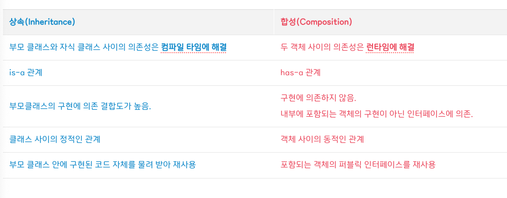

# 상속과 합성, 그리고 상속을 자제하고 합성을 이용하자.



가장 중요한 것은 코드 중복을 제거해서 재사용하면서 변경 및 확장을 용이하게 만드는 것입니다. 그런 관점에서 상속과 합성은 객체지향 프로그래밍에서 가장 많이 사용되는 코드 재사용 기법입니다.

## 상속(Inheritance)

- 클래스 상속을 통해 자식 클래스는 부모 클래스의 자원을 물려받게 되며, 부모 클래스와 다른 부분만 추가하거나 재정의하면서 기존 코드를 쉽게 확장합니다.
- 상속관계는 `is-a` 관계라고도 표현합니다.

상속을 코드의 재사용을 위한 기법이라고 표현하지만, 엄격하게 말하면 그저 코드 재사용을 위한 기법은 아닙니다. 일반적인 클래스가 이미 구현이 되어있는 상태에서 보다 구체적인 클래스를 구현하기 위해서 사용되는 기법이어서 상위 클래스의 코드를 하위 클래스가 재사용할 수 있는 것입니다.

**상속은 명확한 `is-a` 관계에 있는 경우, 그리고 상위 클래스가 확장할 목적으로 설계되었고 문서화도 잘 되어있는 경우에 사용하는게 좋습니다.**

**또한, 상속을 활용하기 위해서는 부모 클래스의 내부 구현에 대해 상세하게 알아야 합니다. 그래서 자식 클래스와 부모 클래스 간의 결합도가 높아질 수 밖에 없으며 상속 관계는 컴파일 타임에 결정되고 고정되기 때문에 코드를 실행하는 도중에 변경할 수 없습니다.**

## 합성(Composition)

- **합성은 기존 클래스를 상속을 통한 확장하는 대신에, 필드로 클래스의 인스턴스를 참조하게 만드는 설계입니다.**
- 학생과 수강과목, 자동차와 엔진종류의 관계처럼 관련이 아예 없지는 않지만 상속 관계로는 애매한 것을 다룰 때 사용되는 기법입니다.
- 합성은 수직관계가 아닌 수평관계입니다. (ex. 모든 차는 엔진을 가집니다)

```java
class Car {
    Engine engine; // 필드로 Engine 클래스 변수를 갖는다(has)

    Car(Engine engine) {
        this.engine = engine; // 생성자 초기화 할때 클래스 필드의 값을 정하게 됨
    }

    void drive() {
        System.out.printf("%s엔진으로 드라이브~\n", engine.EngineType);
    }

    void breaks() {
        System.out.printf("%s엔진으로 브레이크~\n", engine.EngineType);
    }
}

class Engine {
    String EngineType; // 디젤, 가솔린, 전기

    Engine(String type) {
        EngineType = type;
    }
}

public class Main {
    public static void main(String[] args) {
        Car digelCar = new Car(new Engine("디젤"));
        digelCar.drive();

        Car electroCar = new Car(new Engine("전기"));
        electroCar.drive();
    }
}
```

**Car 인스턴스 생성 시에 Engine 인스턴스를 생성해서 넣어줍니다. 이처럼, Car 클래스가 Engine 클래스의 기능이 필요하다고 해서 무조건 상속하는 것이 아닌 클래스 인스턴스 변수에 저장해두고 사용한다는 원리입니다.**

**참고로 합성은 `Has-A` 관계이며 꼭 클래스가 아니어도 인터페이스, 추상클래스로도 가능합니다.**

## 상속보다는 합성을 이용해라

### (1) 결합도가 높아진다.

**객체지향에서는 결합도가 낮을수록, 응집도는 높을수록 좋습니다. 그래서 추상화에 의존하면서 다른 객체에 대한 결합도는 최소화하고 응집도를 최대화해서 변경 가능성을 최소화할 수 있습니다. 하지만, 상속을 하게 되면 부모 클래스와 자식 클래스의 관계가 컴파일 시점에 결정되어 결합도가 높아집니다.**

### (2) 불필요한 기능 상속

예를 들어, 동물들을 Animal 이라는 클래스로 추상화 했다고 하고, Animal에 Fly 라는 메서드가 있다고 가정해 보겠습니다. 만약에 자식 클래스로 Lion이 있다면 적합할까요? 즉, Lion에게는 불필요한 메서드인 것이고, 설령 메서드를 구현하고 빈칸으로 둘 수는 있지만 이는 불필요한 작업입니다.

물론, 인터페이스로 처리는 가능합니다.

### (3) 부모 클래스의 결함이 그대로 넘어옴

상위 클래스에 결함이 있으면 이를 상속한 자식 클래스도 결함을 가지게 됩니다.

### (4) 부모 클래스와 자식 클래스 동시 수정 문제

만약 부모 클래스에서 인스턴스 변수 하나를 추가한다고 하면, 자식 클래스에도 변화가 많이 생기게 됩니다.

이 외에도 메서드 오버라이딩 오동작, 불필요한 인터페이스 상속 문제, 클래스 폭발, 단일 상속 한계 등이 있습니다.

## 합성을 사용해야 하는 이유

**합성은 구현에 의존하지 않는 점에서 상속과 다릅니다. 합성을 이용하게 되면 객체의 내부는 공개되지 않고, 인터페이스를 통해 코드를 재사용하기 때문에 구현에 대한 의존성을 인터페이스에 대한 의존성으로 변경해서 결합도로 낮출 수 있기 때문입니다.**

**그리고 합성은 상속과 다르게 객체 사이의 동적 관계입니다. 상속은 컴파일 시점에 결정하지만, 합성은 실행 시점인 런타임 시점에 동적으로 변경할 수 있습니다.**
그래서 합성을 사용하고 인터페이스 타입을 사용한다면 런타임시에 외부에서 필요한 전략에 따라 교체하고 사용할 수 있기 때문에 유연한 설계를 할 수 있고 이를 전략패턴이라고 합니다.

이처럼 합성은 내부에 포함되는 객체의 구현이 아닌 퍼블릭 인터페이스 통신에 의존합니다. 그래서 합성을 이용하면 포함된 객체의 내부의 구현이 변경되더라도 영향을 최소화 할 수 있기 때문에 변경/수정에 대해 어느정도 안정적입니다.

그리고, 상위 클래스에 의존하지 않기 때문에 변화에 유연합니다. 그래서 부모 클래스에 의존하는 상속의 단점들을 대부분 해결 할 수 있습니다. 합성은 단순히 메소드 호출을 통해 값을 사용하면 되기 때문에 구현이 어렵지도 않습니다.

하지만 아무래로 상속과는 달리 클래스간의 관계를 파악하는데 있어 시간이 걸린다는 단점이 있습니다.

---

## References

- [상속을 자제하고 합성(Composition)을 이용하자](https://inpa.tistory.com/entry/OOP-%F0%9F%92%A0-%EA%B0%9D%EC%B2%B4-%EC%A7%80%ED%96%A5%EC%9D%98-%EC%83%81%EC%86%8D-%EB%AC%B8%EC%A0%9C%EC%A0%90%EA%B3%BC-%ED%95%A9%EC%84%B1Composition-%EC%9D%B4%ED%95%B4%ED%95%98%EA%B8%B0)