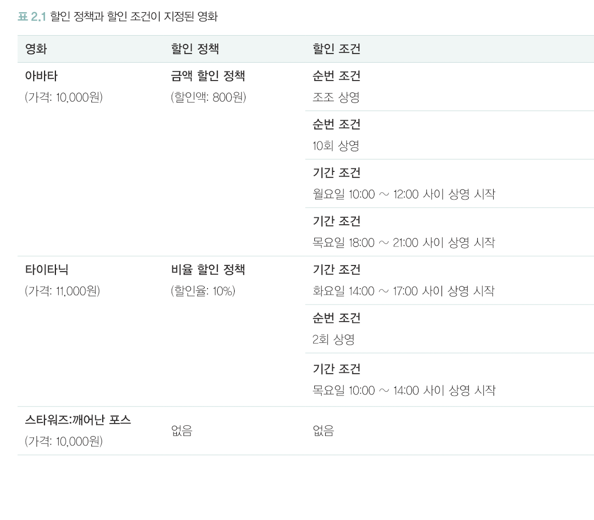
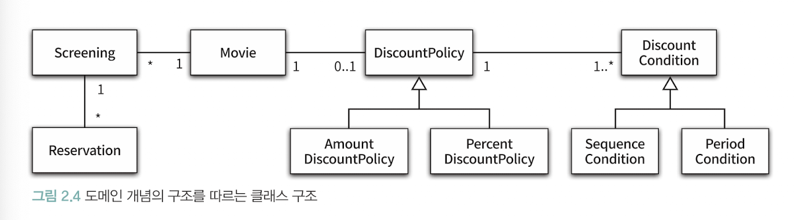
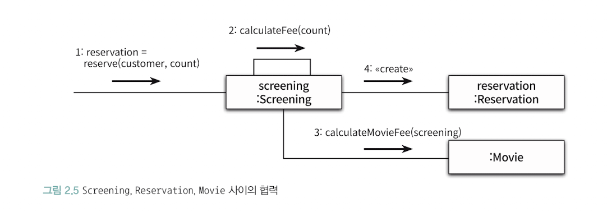
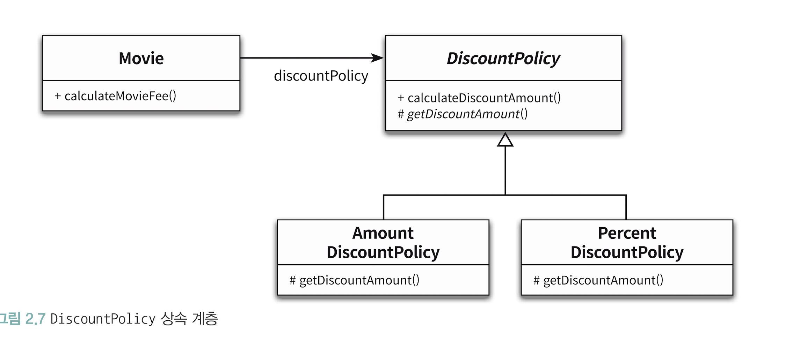

# 챕터02: 객체지향 프로그래밍

## 영화 예매 시스템

-   `영화`: 영화에 대한 기본 정보
-   `상영`: 실제로 관객들이 영화를 관람하는 사건

**고객이 실제로 예매하는 대상은 상영**이다. 관람객이 영화를 예매하는 것은 실제로 특정 시간에 상영되는 영화를 관람할 수 있는 권리를 구매하기 위해 돈을 구매하는 것입니다.

-   할인 조건과 할인 정책
-   할인 조건은 가격의 할인 여부를 결정, 순서 조건 + 기간 조건
-   할인 정책은 할인 요금을 결정, 금액할인정책 + 비율할인정책



위의 사진을 보면, 영화별로 하나의 할인 정책만 할당할 수 있고, 할인조건은 여러개를 할당할 수 있고 순서조건과 기간조건을 섞는 것도 가능합니다.

관객이 할인조건 중 하나를 만족하는지 확인하고 만족하는 경우 할인정책을 이용해서 계산합니다.

## 객체지향 프로그래밍을 향해

### 협력, 객체, 클래스

객체지향은 객체를 지향하는 것입니다. 대부분의 사람들은 클래스를 떠올릴 것이고, 클래스를 결정한 후에 클래스에 어떤 속성과 메서드가 필요한지 고민합니다. 하지만 이는 객체지향과 거리가 멉니다.

> [!IMPORTANT]
>
> -   어떤 클래스가 필요한지를 고민하기 전에 어떤 객체들이 필요한지 고민하자.
> -   객체를 독립적인 존재가 아니라 기능을 구현하기 위해 협력하는 공동체의 일원으로 보자.

### 도메인의 구조를 따르는 프로그램 구조

> [!IMPORTANT]
>
> -   소프트웨어는 사용자가 원하는 어떤 문제를 해결하기 위해 만들어집니다.
> -   영화 예매 시스템의 목적은 영화를 좀 더 쉽고 빠르게 예매하려는 사용자의 문제를 해결하는 것
> -   문제를 해결하기 위해 사용자가 프로그램을 사용하는 분야를 `도메인` 이라고 합니다.

**객체지향 패러다임이 강력한 이유는 요구사항을 분석하는 초기 단계부터 프로그램을 구현하는 마지막 단계까지 객체라는 동일한 추상화 기법을 사용할 수 있기 때문입니다.**



### 클래스 구현하기

> 클래스의 내부와 외부를 구분하는 이유는 `경계의 명확성이 객체의 자율성을 보장`하기 때문입니다.

### 자율적인 객체

-   객체가 상태와 행동을 함께 가지는 복합적인 존재입니다.
-   객체가 스스로 판단하고 행동하는 자율적인 존재라는 것입니다.
-   `캡슐화`: 데이터와 기능을 객체 내부로 묶는 것
-   `접근제어`: 외부에서의 접근을 통제할 수 있는 메커니즘 (public, private, protected)
    -   접근제어를 하는 이유는 객체를 자율적인 존재로 만들기 위해서!
    -   **객체지향의 핵심은 스스로 상태를 관리하고 판단하고 행동하는 자율적인 객체들의 공동체를 구성하는 것이기 때문.**
-   캡슐화와 접근제어는 객체를 크게 퍼블릭 인터페이스와 구현으로 나눕니다 -> 인터페이스와 구현의 분리

**일반적으로 객체의 상태는 숨기고 행동은 외부에 공개해야 합니다.**

### 프로그래머의 자유

프로그래머의 역할은 크게 `클래스 작성자`와 `클라이언트 프로그래머`로 구분합니다.

클래스 작성자는 새로운 데이터 타입을 프로그램에 추가하고 클라이언트 프로그래머는 클래스 작성자가 추가한 데이터 타입을 사용합니다.

### 구현 은닉

클라이언트 프로그래머의 목표는 필요한 클래스들을 엮어서 애플리케이션을 빠르고 안정적으로 구축하는 것입니다.

클래스 작성자는 클라이언트 프로그래머에게 필요한 부분만 공개하고 나머지는 숨겨야 합니다. 이 때 클라이언트 프로그래머가 숨겨놓은 부분에 마음대로 접근할 수 없도록 방지하면서 클라이언트 프로그래머에 대한 영향을 걱정하지 않고도 내부 구현을 변경할 수 있는 것을 구현 은닉이라고 합니다.

클라이언트 프로그래머는 내부의 구현을 무시한 채 인터페이스만 알고 있어도 클래스를 사용할 수 있기 때문에 담아둬야 하는 지식의 양을 줄일 수 있고, 클래스 작성자는 인터페이스를 바꾸지 않는 한 외부에 미치는 영향을 걱정하지 않고도 내부 구현을 마음대로 변경할 수 있습니다.

<br/>

## 협력하는 객체들의 공동체

### Screening과 Movie의 관계에서 궁금한점

> 직접 TS로 구현한 예시는 [example 디렉토리](./example)를 확인해주세요.

해당 시점에서 가장 궁금한 점은 `Movie`와 `Screening`의 `calculateMovieFee` 메서드 사용 관계입니다.

-   관람객이 예약을 하고 싶으면 `Screening(상영)` 객체에 `reserve` 메세지를 보냅니다.
-   `reserve`는 `Reservation(예약)` 객체를 생성하는데 이 때 관람객 수에 따라서 금액을 계산합니다.
-   금액 계산을 할 때 `Movie` 객체에 `calculateMovieFee` 메세지를 보내서 1인당 예약 금액을 계산하고 관람객 수를 곱해서 반환합니다.

> [!NOTE]
>
> -   (1) Movie 객체에서 getFee를 통해 기본 금액을 반환하는 인터페이스를 제공하는데 왜 굳이 calculateMovieFee를 사용하는지?
> -   (2) calculateMovieFee를 사용한다고 할 때, 책에서는 인자로 Screening 객체를 받는데, 이는 왜 또 받는건지? 그냥 Movie 객체에 저장된 fee를 그대로 Money 객체로 변환해서 주면 되는거 아닌지?

이 두가지 궁금증은 이후 남은 책의 내용을 보면서 작성하겠습니다.

### 금액 구현을 위한 Long 타입 -> Money 타입으로 대체

-   Long 타입은 변수의 크기나 연산자의 종류와 관련된 구현 관점의 제약은 표현할 수 있지만, Money 타입처럼 저장하는 값이 금액과 관련되어 있다는 의미를 전달할 수 없습니다.
-   Money 타입이라고 하면 개발자는 "아 저거 돈이랑 연관되어 있네!" 라고 직관적으로 이해할 수 있지만 Long 타입은 그렇지 않다는 겁니다.
-   **객체지향의 장점은 객체를 이용해서 도메인의 의미를 풍부하게 표현할 수 있다는 것입니다. 따라서, 의미를 좀더 명시적이고 분명하게 표현할 수 있다면 객체를 사용해서 해당 개념을 구현하는 것이 좋습니다.**

### 협력 관계



-   영화 예매를 위해서 Screening, Movie, Reservation 인스턴스들이 서로의 메서드를 호출하면서 상호작용합니다.
-   이처럼 시스템의 어떤 기능을 구현하기 위해 객체들 사이에 이뤄지는 상호작용을 `협력(Collaboration)` 이라고 합니다.

**객체지향 프로그램을 작성할 때는 먼저 협력의 관점에서 어떤 객체가 필요한지를 결정하고, 객체들의 공통 상태와 행위를 구현하기 위해 클래스를 작성합니다.**

### 협력에 대한 짧은 이야기

객체의 내부 상태는 외부에서 접근하지 못하도록 감춰야 합니다. 대신에 외부에 공개하는 퍼블릭 인터페이스를 통해 내부 상태에 접근할 수 있도록 허용해야 합니다.

객체는 다른 객체의 인터페이스에 공개된 행동을 수행하도록 요청할 수 있고 요청을 받은 객체는 자율적인 방법에 따라 요청을 처리한 후 응답할 수 있습니다.

메시지를 전송하는 것이 유일하게 특정 객체가 다른 객체와 상호작용 할 수 있는 방법입니다. 메세지를 수신한 객체는 스스로의 결정에 따라 자율적으로 메세지를 처리하게 되는데요, 이처럼 수신한 메세지를 처리하기 위한 자신만의 방법을 메서드라고 합니다.

**Screening이 Movie에게 calculateMovieFee 메세지를 전송한다고 말할 수 있습니다. 하지만 Screening은 Movie안에 calculateMovieFee 메서드가 존재하고 있는지조차 모르고 Movie가 calculateMovieFee 메시지에 응답할 수 있다고 믿고 메시지를 전송할 뿐이라고 합니다.**

<br/>

## 할인 요금 구하기

### 할인 요금 계산을 위한 협력 시작하기

```ts
calculateMovieFee(screening: Screening2): Money2 {
    return this.fee.minus(this.discountPolicy.calculateDiscountAmount(screening));
}
```

앞서 말했듯이 할인정책에는 크게 일정한 금액을 할인해주는 금액 할인 정책이 있고 다른 하나는 일정한 비율에 따라 할인 요금을 결정하는 비율 할인 정책이 있습니다.

그래서 예매 요금을 계산하기 위해서는 현재 영화에 적용되어 있는 할인 정책의 종류를 판단할 수 있어야 하는데요, 해당 코드에서는 할인 정책을 판단하는 코드는 없고 단지 discountPolicy에게 메세지를 전송하고 있습니다.

해당 코드는 객체지향과 아주 밀접한 관계를 가지고 있습니다.<br/>
(상속, 다형성, 추상화)

### 할인 정책과 할인 조건

-   `DiscountPolicy` 라는 클래스는 `추상 클래스`를 사용하기로 했습니다.
-   왜냐하면, 할인 정책은 크게 금액 할인정책과 비율 할인정책이 있는데 `DiscountPolicy`를 생성할 일은 없기 때문입니다.

> [!IMPORTANT]
>
> -   `DiscountPolicy` 클래스는 할인 여부와 요금 계산에 필요한 전체적인 흐름은 정의하지만 실제로 요금을 계산하는 부분은 `getDiscountAmount` 추상 메서드를 통해 계산합니다.
> -   실제로, DiscountPolicy를 상속받은 자식 클래스에서 Overriding 한 메서드가 실행될 것입니다.
> -   이처럼 부모 클래스에 기본적인 알고리즘의 흐름을 구현하고 중간에 필요한 처리를 자식 클래스에게 위임하는 디자인 패턴을 `TEMPLATE METHOD` 패턴이라고 부릅니다.

### 오버라이딩과 오버로딩

-   `오버라이딩`
    -   부모 클래스에 정의된 같은 이름, 같은 파라미터 목록을 가진 메서드를 자식 클래스에서 재정의하는 경우
    -   자식 클래스의 메서드는 오버라이딩한 부모 클래스의 메서드를 가리키기 때문에 외부에서는 부모 클래스의 메서드가 보이지 않습니다.
-   `오버로딩`
    -   메서드의 이름은 같지만 제공되는 파라미터의 목록이 다릅니다.
    -   오버로딩한 메서드는 원래의 메서드를 가리지 않기 때문에 메서드들이 공존합니다.

```ts
function add(a: number, b: number): number;
function add(a: string, b: string): string;
function add(a: number | string, b: number | string): number | string {
    if (typeof a === 'number' && typeof b === 'number') {
        return a + b;
    }
    if (typeof a === 'string' && typeof b === 'string') {
        return a + b;
    }
    throw new Error('매개변수 타입이 올바르지 않습니다.');
}

// 사용 예시
const sum = add(1, 2); // 3
const sum2 = add(1, 'aa'); // ERROR!
const combined = add('Hello, ', 'world!'); // 'Hello, world!'
```

<br/>

## 상속과 다형성

### 컴파일 시간 의존성과 실행시간(런타임) 의존성



-   어떤 클래스가 다른 클래스에 접근할 수 있는 경로를 가지거나 해당 클래스의 객체 메서드를 호출할 경우 두 클래스 사이에 의존성이 존재한다고 말할 수 있습니다.
-   하지만, 영화 요금을 계산하기 위해서는 AmountDiscountPolicy와 PercentDiscountPolicy 인스턴스가 필요한데 Movie 클래스는 이 두 클래스에 의존하지 않고 추상클래스인 DiscountPolicy에 의존합니다.

```ts
function main() {
    const movieAvatar = new Movie(
        "아바타",
        120,
        Money.wons(10000),
        new AmountDiscountPolicy(Money.wons(800), ...)
    );
}

main();
```

-   위의 코드에서는 Movie에 AmountDiscountPolicy를 전달하면서 금액 할인 정책을 적용하게 되었다.
-   만약 비율할인정책을 적용하고 싶으면 전달하는 DiscountPolicy를 변경하면 된다.
-   위의 코드로 인해 실행 시점에서는 Movie 인스턴스가 AmountDiscountPolicy에 의존하게 될 것입니다.

> [!IMPORTANT]
>
> -   코드 상에서는 Movie 클래스는 DiscountPolicy 라는 추상 클래스에 의존합니다.
> -   하지만, 실행 시점에서 Movie의 인스턴스는 AmountDiscountPolicy, PercentDiscountPolicy에 의존하게 됩니다.

**코드의 의존성과 실행 시점의 의존성은 다를 수 있습니다.** 다시 말해서, 클래스 사이의 의존성과 객체 사이의 의존성은 동일하지 않을 수 있습니다.

-   Movie의 인스턴스가 어떤 객체에 의존하고 있는지 어떻게 알 수 있을까요? Movie 클래스만 보면 파악이 어렵습니다. 다만, DiscountPolicy와 동일한 타입을 가지는 대상에 의존한다는 것은 알 수 있습니다.
-   의존하고 있는 객체의 정확한 타입을 알기 위해서는 의존성을 연결하는 부분을 찾아봐야 합니다.

> [!IMPORTANT]
>
> -   설계가 유연해질수록 코드를 이해하고 디버깅하기는 어려워집니다.
> -   하지만, 유연성을 억제하면 코드를 이해하고 디버깅하기는 쉬워지지만 재사용성과 확장 가능성은 낮아집니다.
> -   개발자는 유연성과 가독성 사이에서 고민해야 합니다. 무조건 유연한 설계도, 무조건 읽기 쉬운 코드도 정답이 아닙니다.

<br/>

### 차이에 의한 프로그래밍 (상속)

상속은 객체지향에서 코드를 재사용하기 위해 널리 사용되는 방법입니다. 클래스 사이에 관계를 설정하는 것만으로도 기존 클래스가 가지고 있는 속성, 행동을 새로운 클래스에 포함시킬 수 있습니다. 참고로, DiscountPolicy와 Amount/PercentDiscountPolicy 클래스는 모두 DiscountPolicy 클래스를 상속받아 구현되었습니다.

상속은 기존 클래스를 기반으로 새로운 클래스를 쉽고 빠르게 추가할 수 있는 간편한 방법을 제공합니다. 그리고 상속을 이용하게 되면 부모 클래스의 구현은 공유하면서도 행동이 다른 자식 클래스를 추가할 수 있습니다. `DiscountPolicy` 클래스의 `getDiscountAmount`가 해당 예시가 될 수 있을 것 같습니다.

이처럼 부모 클래스와 다른 부분만을 추가해서 새로운 클래스를 쉽고 빠르게 만드는 방법을 `차이에 의한 프로그래밍` 이라고 합니다.

### 상속과 인터페이스

-   인터페이스는 객체가 이해할 수 있는 메세지의 목록을 정의하는 것입니다. 상속을 통해 자식 클래스는 자신의 인터페이스에 부모 클래스의 인터페이스를 포함하게 됩니다.
-   결과적으로 자식 클래스는 부모 클래스가 수신할 수 있는 모든 메세지를 수신할 수 있기 때문에 외부 객체는 자식 클래스를 부모 클래스와 동일한 타입으로 간주할 수 있습니다.

자식 클래스는 상속을 통해서 부모 클래스의 인터페이스를 물려받기 때문에 부모 클래스 대신 사용될 수 있습니다. 컴파일러는 코드 상에서 부모 클래스가 나오는 모든 장소에서 자식 클래스를 사용하는 것을 허용합니다.

자식 클래스가 부모 클래스를 대신하는 것을 `업캐스팅` 이라고 부릅니다.

### 다형성

메시지와 메서드는 다른개념입니다. Movie는 DiscountPolicy의 인스턴스에게 calculateDiscountAmount 메세지를 전송합니다.
하지만 메서드는 다릅니다.

즉, 코드 상에서 Movie 클래스는 DiscountPolicy 클래스에게 메세지를 전송하지만 실행 시점에 실제로 실행되는 메서드는 Movie와 협력하는 객체의 실제 클래스가 무엇인지에 따라 달라집니다.

**다시 말해서, Movie는 동일한 메세지를 전송하지만 실제로 어떤 메서드가 실행될 것인지는 메세지를 수신하는 객체의 클래스가 무엇이냐에 따라 달라지는데 이를 다형성이라고 합니다.**

**그리고, 다형성은 컴파일 시간 의존성과 런타임 시간 의존성을 다르게 만들 수 있는 객체지향의 특성을 이용해서 서로 다른 메서드를 실행할 수 있게 합니다.**

그리고 다형성은 동일한 메세지를 수신했을 때 객체의 타입에 따라 다르게 응답할 수 있는 능력을 의미합니다.

메세지에 응답하기 위해 실행될 메서드를 컴파일 시점이 아닌 런타임에 결정한다는 공통점이 있는데 이를 `지연 바인딩` 또는 `동적 바인딩` 이라고 부릅니다. 이와 다르게 전통적인 함수 호출처럼 컴파일 시점에 실행될 함수나 프로시저를 결정하는 것은 `초기 바인딩` 또는 `정적 바인딩` 이라고 부릅니다.

**즉, 다형성은 지연 바인딩 때문에 가능한 것이다.**

### 구현 상속과 인터페이스 상속

상속은 크게 구현상속과 인터페이스 상속으로 분류할 수 있습니다. 구현 상속을 서브클래싱, 인터페이스 상속을 서브타이핑이라고 부릅니다. 코드를 재사용하기 위한 목적으로 상속을 구현하는 것을 구현 상속이라고 합니다. 그리고 다형적인 협력을 위해 부모 클래스와 자식 클래스가 인터페이스를 공유할 수 있도록 상속을 이용하는 것을 인터페이스 상속이라고 합니다.

### 인터페이스와 다형성

DiscountPolicy와 다르게 DiscountCondition은 구현을 공유할 필요가 없기 때문에 interface만 사용했습니다. 이를 통해 다형적인 협력에 참여할 수 있도록 합니다.

---

## 정리

-   **객체**는 **상태와 행동을 함께 가지는 복합적인 존재이고, 스스로 판단하고 행동하는 자율적인 존재**입니다.
-   `"객체지향" === "클래스"?` 아니다! **객체지향은 말 그대로 객체를 지향하는 것이며, 클래스는 객체지향을 표현하는 하나의 도구일 뿐입니다.**
    -   **클래스는 공통적인 상태와 행동을 공유하는 객체들을 추상화 한 것 !**
-   객체 내부에 대한 외부의 간섭을 최소화해야 합니다.
-   협력의 관점에서 어떤 객체가 필요한지 먼저 결정하고 객체들의 공통 상태와 행위를 구현하기 위해 클래스를 작성합니다.

-   `도메인(Domain)`: 문제를 해결하기 위해 사용자가 프로그램을 사용하는 분야

-   접근 제어자(public, private, protected)를 적절하게 사용하는 것, 특히 private을 잘 활용하여 캡슐화(은닉)를 잘 수행하면 추후 리팩터링과 기능 확장에 이점을 가질 것 같습니다.

-   객체가 다른 객체와 상호작용할 수 있는 유일한 방법은 `메세지를 전송`하는 것입니다.
-   수신된 메세지를 처리하기 위한 방법을 `메서드` 라고 부릅니다. 그리고 메세지와 메서드를 구분하는 것은 `다형성`의 개념과 연관이 있다.

-   `템플릿 메서드(Template Method)`: **부모 클래스에 기본적인 알고리즘(로직)을 구현하고 중간에 필요한 처리를 자식 클래스에게 위임하는 디자인 패턴**

-   코드의 의존성과 실행 시점의 의존성이 다를 수 있습니다. 의존성이 다르도록 설계를 한다면 유연하고 재사용성을 높일 수 있지만 코드를 이해하기 어려워진다는 단점이 있습니다.
-   설계가 유연해지면 코드를 이해하고 디버깅하기 어려워집니다. 하지만 유연성을 억제하면 코드를 이해하고 디버깅은 쉬워지지만 재사용성과 확장 가능성은 낮아집니다.
-   따라서, 훌륭한 객체지향 개발자로 성장하기 위해서는 유연성과 가독성 사이에서 많은 고민을 해야합니다.
-   지연 바인딩(동적 바인딩): 메시지와 메서드를 실행 시점에 바인딩하는 것
