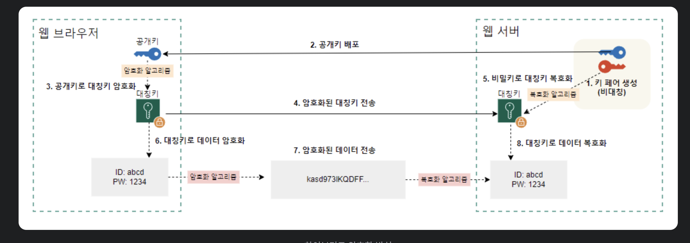

# 대칭키 암호화와 비대칭키 암호화, 그리고 하이브리드 암호화

## 대칭키 암호화 (Symmetric Key)

-   대칭키 암호화는 **암호화와 복호화에 동일한 하나의 키를 사용하는 방식**입니다.
-   `비밀키` 또는 `공유키`라고도 부릅니다.
-   **송신자와 수신자가 사전에 동일한 키를 공유하고 있어**야 데이터를 암호화 또는 복호화할 수 있습니다.

### 작동 방식

-   송신자와 수신자는 사전에 안전한 방법으로 동일한 비밀키를 공유합니다.
-   송신자는 비밀키를 가지고 평문을 암호문으로 만듭니다.
-   암호화된 데이터를 수신자에게 전송합니다.
-   수신자는 공유된 비밀키를 가지고 암호문을 복호화해서 평문을 얻습니다.

### Pros and Cons

-   암/복호화 속도가 빠르며 대용량 데이터 암호화에 적합합니다. 그리고 알고리즘 구현이 굉장히 간단합니다.
-   하지만, 키가 통신 과정에서 유출될 경우 보안에 많이 취약해집니다.
-   또한, 유저가 증가할수록 키교환 횟수가 기하급수적으로 증가합니다.

### 주요 알고리즘

-   `DES(Data Encryption Standard)`: 64비트 블록 암호로, 56비트 비밀키를 사용합니다. 현재는 보안 취약점 때문에 거의 사용되지 않습니다. (3DES: Triple DES)
-   `AES(Advanced Encryption Standard)`: DES의 대안으로 채택된 128비트 블록 암호입니다. 현재 가장 널리 사용되는 대칭키 암호화 방식입니다.

---

## 비대칭키 암호화 (Asymmetric Key)

-   비대칭키 암호화는 **암호화와 복호화에 서로 다른 2개의 키를 사용**하는 방식입니다.
-   **공개키 암호화**라고도 부릅니다. 한 쌍의 키는 `공개키`와 `개인키`로 구성됩니다.
    -   `공개키`: 누구에게나 공개될 수 있는 키. 데이터 암호화 또는 디지털 서명을 확인할 때 사용합니다.
    -   `개인키`: 소유자만이 비밀리에 보관해야 하는 키. 공개키로 암호화된 데이터를 복호화하거나 디지털 서명을 생성할 때 사용합니다.

### 작동 방식

> **A가 B에게 데이터를 보낸다고 가정해보겠습니다.**

-   B는 A에게 본인의 공개키를 전달합니다.
-   A는 B의 공개키로 암호화한 데이터를 보내고, B는 본인의 개인키로 해당 암호화된 데이터를 복호화해서 보게 됩니다.
-   따라서, B의 공개키에 대응되는 개인키를 가지고 있는 B만 데이터를 확인할 수 있습니다.


```
1. B의 공개키/개인키 쌍 생성
2. 공개키 공개(등록), 개인키는 본인이 각자 소유
3. A가 B의 공개키를 받아옴
4. A가 B의 공개키를 활용해서 전송하려고 하는 데이터 암호화
5. 암호화된 데이터를 B에게 전송
6. 데이터를 전달받은 B는 암호화된 데이터를 B의 개인키로 복호화 (개인키는 B만 가지고 있기 때문에 B만 확인 가능하다)
```

### Pros and Cons

-   사용자마다 한 쌍의 키(공개키, 개인키)만 관리하면 되기 때문에 **키 분배 문제가 해결**됩니다.
-   또한, 중간 공격자가 공개키를 얻는다고 해도 개인키로만 복호화가 가능하기 때문에 **기밀성을 강화**할 수 있으며 **개인키를 가지고 있는 수신자만이 암호화된 데이터를 복호화할 수 있기 때문에 일종의 인증기능도 제공한다는 장점**이 있습니다.
-   하지만, 대칭키 암호화에 비해 추가 연산이 있기 때문에 속도가 느립니다.

### 주요 알고리즘

-   `RSA(Rivest-Shamir-Adleman)`: 대표적으로 사용되는 공개키 암호 알고리즘. 소인수 분해의 어려움에 기반합니다.
-   `ECC(Elliptic Curve Cryptography)`: 타원 곡선의 수학적 원리를 이용한 암호화 방식. RSA에 비해 더 짧은 키로도 유사한 수준의 보안 강도를 제공하기 때문에 모바일 환경 등 제한된 환경에서 각광받고 있습니다.

---

## 하이브리드 암호화 (Hybrid Ecryption)

> -   **`대칭키 암호화`와 `비대칭키 암호화`의 장점을 결합한 암호화 방식**
> -   `대칭키 암호화`: 하나의 키로 암/복호화 -> 속도가 매우빠르고 대용량 데이터에 적합합니다.
> -   `비대칭키 암호화`: 공개키/개인키를 활용하여 보안 강화

### 동작 방식



```
< 만약 암호화된 대칭키가 제3자에게 탈취를 당하면? >

- 해당 대칭키는 웹 서버의 공개키로 암호화 된 대칭키입니다.
- 암호화 된 대칭키를 복호화하기 위해서는 웹 서버의 개인키가 필요합니다.
- 따라서, 제3자가 탈취를 해도 웹 서버의 개인키를 가지고 있지 않으면 복호화를 할 수 없습니다.
```

### 대표 사용 사례

-   대표적으로 HTTPS 또는 SSL/TLS 에서 사용됩니다.
-   자세한 사례는 추후 정리해봅니다.

---

## References

-   https://kdeon.tistory.com/132
-   https://jstreambox.tistory.com/entry/%ED%95%98%EC%9D%B4%EB%B8%8C%EB%A6%AC%EB%93%9C-%EC%95%94%ED%98%B8%ED%99%94%EC%99%80-%EC%9E%A5%EC%A0%90-%EB%B0%8F-%EB%8B%A8%EC%A0%90
-   https://liveyourit.tistory.com/183
-   https://loosie.tistory.com/718
